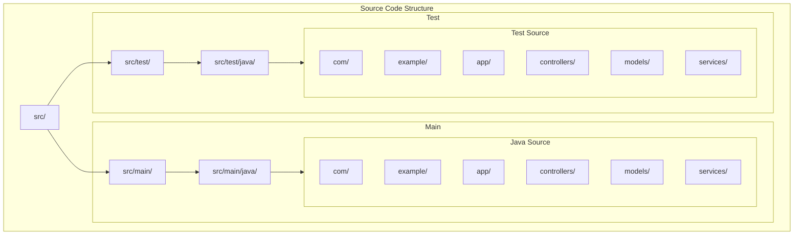

# Shell Demo Database Utility

## Source Code Structure



## Project Overview

This project follows a standard Maven/Java project structure with separate source and test directories. The main application code is organized under `src/main/java` while test code resides in `src/test/java`.

### Main Components

- `controllers/` - REST controllers and API endpoints
- `models/` - Domain models and data structures
- `services/` - Business logic and service implementations

### Testing

- Tests mirror the main source structure
- Each component has corresponding test classes
- Located under `src/test/java`

## Development

### Prerequisites

- Java 11 or higher
- Maven 3.6+

### Project Analysis & Testing

The project includes comprehensive tools for code analysis, structure verification, and testing:

#### 1. Project Structure Analysis

```bash
# Show complete project structure
./scripts/project-analysis/analyze.sh structure

# Shows:
- Directory hierarchy
- File counts by type
- Package organization
- Memory bank structure
```

#### 2. Code Pattern Analysis

```bash
# Find similar code patterns
./scripts/project-analysis/analyze.sh similar 'pattern' ['*.ext']

# Examples:
./scripts/project-analysis/analyze.sh similar 'class.*implements' '*.java'
./scripts/project-analysis/analyze.sh similar 'function.*export' '*.js'
```

#### 3. Java Package Analysis

```bash
# Analyze Java package organization
./scripts/project-analysis/analyze.sh packages

# Shows:
- Package hierarchy
- Class/interface declarations
- Dependencies between packages
```

#### 4. File Location Suggestions

```bash
# Get suggestions for new files
./scripts/project-analysis/analyze.sh suggest filename.ext

# Examples:
./scripts/project-analysis/analyze.sh suggest UserService.java
./scripts/project-analysis/analyze.sh suggest config.yaml
```

#### 5. Duplicate Detection

```bash
# Check for potential duplicates
./scripts/project-analysis/analyze.sh check filename.ext ['pattern']

# Examples:
./scripts/project-analysis/analyze.sh check '*.java'
./scripts/project-analysis/analyze.sh check UserService.java 'class.*Service'
```

### Configuration Best Practices

1. **Before Adding New Code**:

   ```bash
   # Check existing structure
   ./scripts/project-analysis/analyze.sh structure

   # Get location suggestions
   ./scripts/project-analysis/analyze.sh suggest newfile.ext

   # Check for duplicates
   ./scripts/project-analysis/analyze.sh check newfile.ext
   ```

2. **During Code Review**:

   ```bash
   # Find similar patterns
   ./scripts/project-analysis/analyze.sh similar 'pattern' '*.ext'

   # Check package structure
   ./scripts/project-analysis/analyze.sh packages
   ```

3. **Project Maintenance**:

   ```bash
   # Verify structure
   ./scripts/project-analysis/analyze.sh structure

   # Check for duplicates
   ./scripts/project-analysis/analyze.sh check '*.ext'
   ```

### Building

```bash
mvn clean install
```

### Running Tests

#### Running All Tests

Run the entire test suite:

```bash
mvn test
```

#### Running Specific Tests

Run all tests in a specific class:

```bash
mvn test -Dtest=com.example.shelldemo.UnifiedDatabaseRunnerTest -DforkCount=0
```

Run a specific test method in `UnifiedDatabaseRunnerTest`:

```bash
# Test connection to HR schema
mvn test -Dtest=com.example.shelldemo.UnifiedDatabaseRunnerTest#testHRSchemaConnection -DforkCount=0

# Test query with real data
mvn test -Dtest=com.example.shelldemo.UnifiedDatabaseRunnerTest#testQueryWithRealData -DforkCount=0

# Test execute SQL script file
mvn test -Dtest=com.example.shelldemo.UnifiedDatabaseRunnerTest#testExecuteScriptFile -DforkCount=0

# Test SQL DDL script
mvn test -Dtest=com.example.shelldemo.UnifiedDatabaseRunnerTest#testSqlDdlScript -DforkCount=0

# Test Oracle Function Creation
mvn test -Dtest=com.example.shelldemo.UnifiedDatabaseRunnerTest#testOracleFunctionCreation -DforkCount=0

# Test example (generic validation)
mvn test -Dtest=com.example.shelldemo.UnifiedDatabaseRunnerTest#testExample -DforkCount=0
```

Run all tests in another class (example):

```bash
mvn test -Dtest=SqlScriptParserTest -DforkCount=0
```

Run a specific test method in another class (example):

```bash
mvn test -Dtest=SqlScriptParserTest#testParseMixedSqlAndPlsql -DforkCount=0
```

Run multiple test classes:

```bash

mvn test -Dtest=com.example.shelldemo.parser.UnifiedDatabaseRunnerTest -DforkCount=0


mvn test -Dtest=SqlScriptParserTest,DatabaseConfigTest -DforkCount=0
```

Run tests matching a pattern:

```bash
mvn test -Dtest=*Parser*Test -DforkCount=0
```

#### Important Notes on Test Execution

- The `-DforkCount=0` parameter is required due to JVM argument handling in the current configuration
- Omitting this parameter may result in "The forked VM terminated without properly saying goodbye" errors
- For detailed test output, add the `-Dsurefire.useFile=false` parameter

#### Test Output

View test results in the following locations:

- Console output during test execution
- Surefire reports: `app/target/surefire-reports/`
- Test logs: `app/logs/test/` (if configured)

#### Debugging Tests

To debug tests, use:

```bash
mvn test -Dtest=SqlScriptParserTest -DforkCount=0 -Dmaven.surefire.debug
```

This will pause execution and wait for a debugger to connect on port 5005.

#### Troubleshooting Common Test Issues

1. **"The forked VM terminated without properly saying goodbye" error**:
   - Use `-DforkCount=0` as shown in the examples above
   - This forces Maven to run tests in the same JVM, avoiding argument handling issues

2. **"useSystemClassloader setting has no effect when not forking" warning**:
   - This warning appears when using `-DforkCount=0`
   - It's harmless and can be safely ignored
   - It simply indicates that the system classloader setting doesn't apply when tests run in the same JVM

3. **"Async contains an invalid element or attribute DiscardingThreshold" warning**:
   - This is caused by an invalid Log4j2 configuration
   - The `DiscardingThreshold` element has been removed from the configuration
   - No action is required as this has been fixed

4. **Database connection errors**:
   - Ensure the Oracle database is running and accessible
   - Verify the connection parameters in the test class match your environment
   - Check that the HR schema is properly set up

## Documentation

For detailed documentation about the project's memory bank and development practices, see:

- [Memory Bank Documentation](memory-bank/README.md)
- [Technical Context](memory-bank/core/techContext.mdc)
- [System Patterns](memory-bank/core/systemPatterns.mdc)
- [Project Scripts](memory-bank/core/scripts.mdc)

## Database Configuration

### Oracle Database Password

When running the application in a dev container, the database password for the application user is automatically generated for security. To retrieve the current password, you can use either of these methods:

1. Using the provided script:

   ```bash
   ./.devcontainer/get-db-password.sh
   ```

2. Direct file access:

   ```bash
   cat /run/secrets/app_user_password
   ```

Note: The password is regenerated each time the dev container is rebuilt, but remains consistent during the container's lifetime.

### Oracle Database Passwords

When using the `gvenzl/oracle-free` image without specifying passwords, they are automatically generated for security. To retrieve the passwords:

```bash
# Get all Oracle passwords
make get-oracle-passwords

# Or individually:
# For SYSTEM user
docker exec oracledb cat /opt/oracle/oradata/.docker_temp_password

# For APP_USER (HR)
docker exec oracledb cat /opt/oracle/oradata/.app_user_temp_password
```

Note: These passwords persist as long as the Oracle data volume exists. They will be regenerated if you remove the volume and recreate the container.

## Configuration System

### Overview

The application uses a custom configuration system built around `ConfigurationHolder` and `YamlConfigReader`:

- `ConfigurationHolder`: Singleton that loads and caches configuration at startup
- `YamlConfigReader`: Reads YAML configuration files using Jackson
- Default configuration loaded from `application.yaml`
- Runtime properties managed through `DatabaseProperties`

### Environment Variables

Environment variables are handled through:

1. `.env` file in `.devcontainer` directory
2. Variables loaded into environment when container starts
3. Accessed through `System.getenv()`

### Configuration Hierarchy

(highest to lowest priority)

1. Environment Variables
   - Set in `.devcontainer/.env`
   - Override all other configuration sources
   - Loaded when container starts

2. Runtime Properties
   - Set through `DatabaseProperties.setRuntimeProperty()`
   - Can be modified during application execution
   - Cached in `ConfigurationHolder`

3. YAML Configuration
   - Primary configuration in `application.yaml`
   - Database instances in `dblist.yaml`
   - Provides default values

### Key Components

1. Core Classes
   - `ConfigurationHolder`: Singleton that manages all configuration
   - `DatabaseProperties`: Manages database-specific properties
   - `ConnectionConfig`: Base class for connection configuration
   - `LdapServerConfig`: LDAP-specific configuration

2. Configuration Files
   - `.devcontainer/.env`: Container environment variables
   - `application.yaml`: Main application configuration
   - `dblist.yaml`: Database instance definitions
   - `log4j2.xml`: Logging configuration

### Implementation Details

1. Configuration Loading
   - YAML files parsed using Jackson
   - Environment variables loaded at container startup
   - Configuration cached for performance

2. Type Safety
   - Model classes for structured configuration
   - Validation at startup
   - Strong typing for all configuration values

3. Security
   - Sensitive data stored in environment variables
   - Passwords and keys masked in logs
   - Secure default values

### Best Practices for Data Handling

1. Sensitive Data
   - Store in environment variables
   - Never commit to version control
   - Mask in logs using `********`

2. Configuration Access
   - Use `DatabaseProperties` for database config
   - Access environment variables through system
   - Cache configuration for performance

3. Type Safety
   - Use model classes (`ConnectionConfig`, `LdapServerConfig`)
   - Validate configuration at startup
   - Provide meaningful error messages

4. Design Principles
   - Configuration is externalized
   - Clear separation of concerns
   - Consistent access patterns
   - Fail-fast validation

### Usage Example

```java
// Access configuration through ConfigurationHolder
DatabaseConfig config = ConfigurationHolder.getInstance().getDatabaseConfig();

// Set runtime property
DatabaseProperties.setRuntimeProperty("db.timeout", "30");

// Access environment variable
String dbPassword = System.getenv("DB_PASSWORD");
```

## Logging Configuration

### Logging Overview

The application uses Log4j2 for logging with two main components:

1. Regular application logging (`logger`)
2. Method-specific detailed logging (`methodLogger`)

### Log Levels

- **TRACE**: Detailed operation information (SQL queries, parameter values)
- **DEBUG**: Operation lifecycle events (method entry/exit, state changes)
- **INFO**: Important state changes and operation results
- **ERROR**: Failures with detailed context

### Configuration

#### Method-Specific Debug Logging

To enable detailed method-level logging, add the following to your `log4j2.xml`:

```xml
<!-- Regular application logging -->
<Logger name="com.example.shelldemo" level="INFO" additivity="false">
    <AppenderRef ref="Console"/>
    <AppenderRef ref="File"/>
</Logger>

<!-- Method-specific detailed logging -->
<Logger name="com.example.shelldemo.UnifiedDatabaseRunner.methods" level="DEBUG" additivity="false">
    <AppenderRef ref="Console"/>
    <AppenderRef ref="MethodDebugFile"/>
</Logger>
```

#### Log File Configuration

```xml
<!-- Regular log file -->
<RollingRandomAccessFile name="File"
    fileName="logs/application.log"
    filePattern="logs/archive/application-%d{yyyy-MM-dd}-%i.log.gz"
    append="true">
    <PatternLayout pattern="%d{yyyy-MM-dd HH:mm:ss} [%t] %-5level %logger{36} - %msg%n"/>
    <Policies>
        <TimeBasedTriggeringPolicy/>
        <SizeBasedTriggeringPolicy size="100 MB"/>
    </Policies>
    <DefaultRolloverStrategy max="30"/>
</RollingRandomAccessFile>

<!-- Method debug log file -->
<RollingRandomAccessFile name="MethodDebugFile"
    fileName="logs/method-debug.log"
    filePattern="logs/archive/method-debug-%d{yyyy-MM-dd}-%i.log.gz"
    append="true">
    <PatternLayout pattern="%d{yyyy-MM-dd HH:mm:ss} [%t] %-5level %logger{36} - %msg%n"/>
    <Policies>
        <TimeBasedTriggeringPolicy/>
        <SizeBasedTriggeringPolicy size="100 MB"/>
    </Policies>
    <DefaultRolloverStrategy max="30"/>
</RollingRandomAccessFile>
```

### Available Debug Information

#### Database Operations

- Script execution progress
- SQL statement details
- Statement execution status
- Parameter values (masked for sensitive data)
- Execution times

#### Stored Procedures

- Parameter parsing details
- Execution progress
- Return values
- Error context

#### Database configuration details

- Database connection details
- Configuration validation
- Driver loading status

### Example Log Output

Regular application log:

```bash
2024-03-15 10:30:45 [main] INFO  UnifiedDatabaseRunner - Executing SQL script: /path/to/script.sql
2024-03-15 10:30:46 [main] INFO  UnifiedDatabaseRunner - Script execution completed successfully - 5 statements executed
```

Method-specific debug log:

```bash
2024-03-15 10:30:45 [main] DEBUG [executeScript] Starting execution of script: script.sql
2024-03-15 10:30:45 [main] DEBUG [executeScript] Parsed 5 SQL statements from file
2024-03-15 10:30:45 [main] DEBUG [executeScript] Processing statement 1/5
2024-03-15 10:30:45 [main] DEBUG [executeScript] Statement 1/5 executed successfully
```

### Enabling Debug Logging

1. **Production Environment**:
   - Set regular logging to `INFO`
   - Disable method-specific logging or set to `ERROR`

2. **Development Environment**:
   - Set regular logging to `DEBUG`
   - Set method-specific logging to `DEBUG` or `TRACE`

3. **Troubleshooting**:
   - Enable method-specific logging: `DEBUG` or `TRACE`
   - Check `logs/method-debug.log` for detailed execution flow

### Performance Considerations

- Method-specific logging at `TRACE` level may impact performance
- Use `DEBUG` level for general troubleshooting
- In production, keep method-specific logging at `ERROR` or disabled

### Log File Locations

- Regular logs: `logs/application.log`
- Method debug logs: `logs/method-debug.log`
- Rolling policy: Daily rotation with compression
- Retention: 30 days for regular logs, 7 days for debug logs

## Maven Version Management Commands

```bash
# Display all dependency updates
mvn versions:display-dependency-updates

# Display plugin updates
mvn versions:display-plugin-updates

# Display property updates (checks properties used in versions)
mvn versions:display-property-updates

# Update all dependencies to their latest versions
mvn versions:use-latest-versions

# Update a specific property version
mvn versions:set-property -Dproperty=spring-shell.version -DnewVersion=3.2.1

# Set project version
mvn versions:set -DnewVersion=1.0.1-SNAPSHOT

# Revert changes made by versions:set
mvn versions:revert

# Commit changes made by versions:set
mvn versions:commit

# Update parent version
mvn versions:update-parent

# Force updating snapshots
mvn versions:use-latest-versions -DallowSnapshots=true

# Update versions excluding specific dependencies
mvn versions:use-latest-versions -Dexcludes=org.springframework.*:*

# Generate dependency tree report
mvn versions:dependency-updates-report

# Update to the next snapshot version
mvn versions:set -DnextSnapshot=true

# Lock snapshots to their current timestamp version
mvn versions:lock-snapshots

# Unlock snapshots
mvn versions:unlock-snapshots
```

Tips for version management:

- Always review changes before committing
- Use `display-*` commands to preview updates
- Backup `pom.xml` before making major version changes
- Test thoroughly after version updates
- Consider using `-DallowMajorUpdates=false` for safer updates
- Use `-DprocessParent=true` to include parent POM in updates

### Maven Shade Plugin Configuration

#### Log4j2 Plugin Transformer

To properly merge Log4j2 resources and prevent resource overlap warnings during the build, the following configuration is added to the Maven Shade Plugin:

```xml
<transformer implementation="com.github.edwgiz.maven_shade_plugin.log4j2_cache_transformer.PluginsCacheFileTransformer" />
```

This transformer requires an additional dependency in the plugin configuration:

```xml
<dependencies>
  <dependency>
    <groupId>com.github.edwgiz</groupId>
    <artifactId>maven-shade-plugin.log4j2-cachefile-transformer</artifactId>
    <version>2.15</version>
  </dependency>
</dependencies>
```

This configuration:

- Properly merges Log4j2 plugin cache files
- Eliminates resource overlap warnings
- Ensures correct loading of Log4j2 plugins in the shaded JAR
- Handles the `META-INF/org/apache/logging/log4j/core/config/plugins/Log4j2Plugins.dat` resource

After adding this configuration, the warning about overlapping Log4j2 resources during the Maven build process will be resolved.

```bash
docker exec <container_name> cat /run/secrets/app_user_password

git config --global user.name "swapan chakrabarty" &&\
git config --global user.email "<swapan.chakrabarty@datahawklab.com>"

git config --global init.defaultBranch main
git config --global pull.rebase false
git config --global core.fileMode false
git config --global core.longpaths true
git config --global core.symlinks true
```

## Project Documentation

### Analysis & Testing Tools

#### 1. Project Structure Analysis

```bash
# Show complete project structure
./scripts/analysis/code-analysis/analyze_structure.sh

# Shows:
- Directory hierarchy
- File counts by type
- Package organization
- Memory bank structure
```

#### 2. Analysis Pattern Tools

```bash
# Find similar code patterns
./scripts/project-analysis/analyze.sh similar 'pattern' ['*.ext']

# Examples:
./scripts/project-analysis/analyze.sh similar 'class.*implements' '*.java'
./scripts/project-analysis/analyze.sh similar 'function.*export' '*.js'
```

#### 3. Java Package Analysis

```bash
# Analyze Java package organization
./scripts/project-analysis/analyze.sh packages

# Shows:
- Package hierarchy
- Class/interface declarations
- Dependencies between packages
```

#### 4. File Location Suggestions

```bash
# Get suggestions for new files
./scripts/project-analysis/analyze.sh suggest filename.ext

# Examples:
./scripts/project-analysis/analyze.sh suggest UserService.java
./scripts/project-analysis/analyze.sh suggest config.yaml
```

#### 5. Duplicate Detection

```bash
# Check for potential duplicates
./scripts/project-analysis/analyze.sh check filename.ext ['pattern']

# Examples:
./scripts/project-analysis/analyze.sh check '*.java'
./scripts/project-analysis/analyze.sh check UserService.java 'class.*Service'
```

## Best Practices

### 1. Before Adding New Code

```bash
# Check existing structure
./scripts/project-analysis/analyze.sh structure

# Get location suggestions
./scripts/project-analysis/analyze.sh suggest newfile.ext

# Check for duplicates
./scripts/project-analysis/analyze.sh check newfile.ext
```

### 2. During Code Review

```bash
# Find similar patterns
./scripts/project-analysis/analyze.sh similar 'pattern' '*.ext'

# Check package structure
./scripts/project-analysis/analyze.sh packages
```

### 3. Project Maintenance

```bash
# Verify structure
./scripts/project-analysis/analyze.sh structure

# Check for duplicates
./scripts/project-analysis/analyze.sh check '*.ext'
```

## Command Output Examples

### Structure Analysis

```bash
Project Structure:
└── src/
    ├── main/
    │   └── java/
    │       └── com/example/
    │           ├── controllers/
    │           ├── services/
    │           └── models/
    └── test/
        └── java/
            └── com/example/
                └── tests/

File counts:
- Java: 45 files
- Tests: 32 files
- Config: 8 files
```

### Pattern Analysis

```bash
Similar patterns found:
1. UserService.java:120 - "implements UserRepository"
2. ProductService.java:85 - "implements ProductRepository"
3. OrderService.java:150 - "implements OrderRepository"
```

### Package Analysis

```bash
Package hierarchy:
com.example
├── controllers
│   ├── UserController
│   └── ProductController
├── services
│   ├── UserService
│   └── ProductService
└── models
    ├── User
    └── Product
```

### File Suggestions

```bash
Suggested locations for UserService.java:
1. src/main/java/com/example/services/
2. src/main/java/com/example/core/services/
3. src/main/java/com/example/user/services/
```

### Duplicate Check

```
Potential duplicates found:
1. UserService.java ~ UserServiceImpl.java (80% similar)
2. ProductDTO.java ~ ProductModel.java (65% similar)
```

## Usage Guidelines

1. **Regular Analysis**:
   - Run structure analysis weekly
   - Check for duplicates during reviews
   - Analyze packages before refactoring

2. **Code Organization**:
   - Follow package suggestions
   - Keep similar patterns consistent
   - Document significant deviations

3. **Maintenance**:
   - Update after major changes
   - Clean up duplicate patterns
   - Maintain consistent structure

## Testing Dependencies

### Core Testing Libraries

The parent POM includes these essential testing dependencies:

- **JUnit Jupiter (junit-jupiter)** - The main testing framework
- **Mockito Core (mockito-core)** - For mocking in unit tests
- **Mockito JUnit Jupiter (mockito-junit-jupiter)** - Integration between Mockito and JUnit

### Additional Testing Libraries

For more comprehensive testing capabilities, we've added:

- **AssertJ** - Provides fluent assertions that are more readable and IDE-friendly

  ```java
  assertThat(result).isEqualTo(expected)
  ```

- **Hamcrest** - Offers powerful matchers for complex assertions

  ```java
  assertThat(result, hasProperty("name", equalTo("test")))
  ```

- **JUnit Pioneer** - Adds useful extensions for JUnit Jupiter like temporary directory improvements and system property handling

  ```java
  @TempDir
  Path tempDir;
  ```

- **JsonAssert** - Specifically for testing JSON structures (useful since we're using Jackson)

  ```java
  JSONAssert.assertEquals(expectedJson, actualJson, false)
  ```

### Dependency Management

- All testing dependencies are defined in the parent POM for version consistency
- Dependencies are added with `<scope>test</scope>` in module POMs
- Test dependencies are only available during testing, not in the production classpath

## Reporting Setup and Implementation

### Overview

The application includes a comprehensive reporting system that provides:

1. Command output reporting
2. Test execution reporting
3. Database operation reporting
4. Analysis reporting

### Command Output Reporting

#### Output Formats

- **Standard Output**: Regular command execution results
- **CSV Format**: Structured data output for database queries

  ```bash
  --csv-output "results.csv"
  ```

- **Detailed Logging**: Method-level execution details

#### Database Operation Reports

```java
DatabaseLoginServiceTestResult {
    - Database name
    - Service name
    - Database type
    - Success status
    - Response time (ms)
    - Error message (if any)
    - SQL state
}
```

### Test Execution Reports

#### Test Output Structure

1. **Test Start**:

```bash
========================================
Test * testName
========================================
```

2. **Test Completion**:

```bash
========================================
Test * testName * SUCCESS ✓
========================================
```

3. **Failure Handling**:
   - SQL files preserved on test failure
   - Timestamped directories for failed tests
   - Detailed error context

#### Test Report Location

- Failed SQL tests: `failed_sql_tests/`
- Test logs: `logs/test/`
- Surefire reports: `target/surefire-reports/`

### Analysis Reports

#### Structure Analysis

```bash
./scripts/project-analysis/analyze.sh structure
```

Generates:

- Directory hierarchy
- File statistics
- Package organization
- Memory bank structure

#### Pattern Analysis

```bash
./scripts/project-analysis/analyze.sh similar 'pattern' '*.ext'
```

Reports:

- Common code patterns
- Similar implementations
- Potential duplicates

#### Dependency Analysis

```bash
./scripts/project-analysis/analyze.sh dependencies
```

Provides:

- Maven dependency tree
- Version conflicts
- Unused dependencies

### Report Validation

#### Output Validation

```bash
./scripts/analysis/validation/validate_output.sh
```

Checks:

- Command output format
- Expected patterns
- Error conditions

#### Directory Validation

```bash
./scripts/analysis/validation/validate_output.sh --directory
```

Verifies:

- Required files
- File permissions
- Directory structure

### Best Practices

1. **Report Generation**:
   - Use appropriate output format for data type
   - Include timestamps in report files
   - Maintain consistent naming conventions

2. **Error Reporting**:
   - Include context with errors
   - Preserve failed test artifacts
   - Log stack traces for debugging

3. **Performance Considerations**:
   - Use async logging for large reports
   - Implement log rotation
   - Clean up old report files

4. **Security**:
   - Mask sensitive data in reports
   - Secure report file permissions
   - Validate output paths

### Report File Locations

- Analysis reports: `logs/analysis/`
- Validation reports: `logs/validation/`
- Test reports: `logs/test/`
- Command output: `logs/output/`

### Report Retention

- Analysis reports: 30 days
- Test reports: 7 days
- Failed test artifacts: 30 days
- Command output: 7 days

Dynamic JDBC Driver Loading Flow
-------------------------------

```
ConfigurationHolder (Global Configuration)
    ↓
UnifiedDatabaseRunner (CLI/Entry point)
    │   [1. User provides --driver-path argument]
    │
    ├─> UnifiedDatabaseOperation
    │      │   [2. loadDriverFromPath loads JAR]
    │      │   [3. Creates URLClassLoader]
    │      │   [4. Uses ServiceLoader to find drivers]
    │      │
    │      ├─> CustomDriver (JDBC driver wrapper)
    │      │     [5. Wraps each found driver]
    │      │     [6. Registers with DriverManager]
    │      │
    │      └─> DatabaseConnectionFactory
                 [7. Uses registered driver via DriverManager.getConnection]
```

Code Flow:

1. CLI Input:

```java
   @Option(names = {"--driver-path"}, description = "Path to JDBC driver JAR file")
   private String driverPath;
```

2. Runner triggers loading:

```java
   if (driverPath != null) {
       dbOperation.loadDriverFromPath(driverPath);
   }
```

3. Driver Loading:

```java
   public void loadDriverFromPath(String path) {
       File driverFile = new File(path);
       URL driverUrl = driverFile.toURI().toURL();
       URLClassLoader loader = new URLClassLoader(
           new URL[]{driverUrl},
           getClass().getClassLoader()
       );

       // Find and register drivers
       ServiceLoader<Driver> drivers = ServiceLoader.load(Driver.class, loader);
       for (Driver driver : drivers) {
           DriverManager.registerDriver(new CustomDriver(driver));
       }
   }
```

4. Driver Wrapping:

```java
   public class CustomDriver implements Driver {
       private final Driver delegate;

       public CustomDriver(Driver delegate) {
           this.delegate = delegate;
       }

       @Override
       public Connection connect(String url, Properties info) throws SQLException {
           return delegate.connect(url, info);
       }
       // ... other JDBC Driver interface methods
   }
```

5. Using Loaded Driver:

```java
   public Connection getConnection(ConnectionConfig config) throws SQLException {
       String connectionUrl = String.format(CONNECTION_TEMPLATES.get(dbType),
           config.getHost(), config.getPort(), config.getServiceName());
       // DriverManager automatically uses our registered CustomDriver
       return DriverManager.getConnection(connectionUrl, props);
   }
```

::: mermaid
graph TD;
    A[UnifiedDatabaseRunner<br/>CLI/Entry point] -->|executes| B[UnifiedDatabaseOperation<br/>SQL/SP/Function Executor]
    CH[ConfigurationHolder] -.->|used by| A
    CH -.->|used by| B

    B --> C[DatabaseConnectionFactory<br/>Connection Management]
    CH -.->|used by| C

    C --> D[CustomDriver<br/>JDBC Driver Wrapper]
    C --> E[ConnectionConfig<br/>Connection Settings]

    B --> F[DatabaserOperationValidator<br/>SQL/PL-SQL Validation]
    F --> |uses| C

    B --> G[Parser Components]
    G --> H[SqlScriptParser<br/>SQL Script Parsing]
    G --> I[StoredProcedure Components]

    I --> J[StoredProcedureParser]
    I --> K[StoredProcedureValidator]
    I --> L[StoredProcedureInfo]
    I --> M[ProcedureParam]

    B --> N[Error Handling]
    N --> O[DatabaseErrorFormatter]
    N --> P[Exception Hierarchy]


    class CH config
    class A,B main
    class C,D,E,F,G,H,I,J,K,L,M,N,O,P component
:::

::: mermaid
graph TD
    subgraph Global
        CH[ConfigurationHolder<br/>Global Configuration]
    end

    subgraph CLI
        A[UnifiedDatabaseRunner<br/>CLI/Entry point]
    end

    subgraph Operations
        B[UnifiedDatabaseOperation]

        subgraph Driver Management
            D[CustomDriver<br/>JDBC Driver Wrapper]
        end

        subgraph Connection
            C[DatabaseConnectionFactory]
        end
    end

    CH -->|configures| A
    A -->|executes| B
    B -->|creates| D
    B -->|uses| C
:::

based on this

```java
public class SqlScriptExecutor {
    private static final Logger logger = LogManager.getLogger(SqlScriptExecutor.class);

    @FunctionalInterface
    public interface SqlExecutor {
        Object execute(Statement stmt, String sql) throws SQLException;
    }

    private static final SqlExecutor PLSQL_EXECUTOR = (stmt, sql) -> {
        logger.debug("Executing PL/SQL block");
        return stmt.execute(sql);
    };

    private static final SqlExecutor SQL_EXECUTOR = (stmt, sql) -> {
        logger.debug("Executing SQL statement");
        return stmt.executeUpdate(sql);
    };

    public void executeScript(Connection conn, String scriptPath) throws SQLException, IOException {
        List<String> statements = SqlScriptParser.parse(new File(scriptPath));

        for (String sql : statements) {
            String trimmedSql = sql.trim().toUpperCase();
            SqlExecutor executor = determineExecutor(trimmedSql);

            executeSqlStatement(conn, sql, executor);
        }
    }

    private SqlExecutor determineExecutor(String sql) {
        return isPLSQL(sql) ? PLSQL_EXECUTOR : SQL_EXECUTOR;
    }

    private boolean isPLSQL(String sql) {
        return sql.startsWith("BEGIN") ||
               sql.startsWith("DECLARE") ||
               sql.startsWith("CREATE") ||
               sql.contains("END;") ||
               sql.contains("PROCEDURE") ||
               sql.contains("FUNCTION") ||
               sql.contains("PACKAGE");
    }

    private void executeSqlStatement(Connection conn, String sql, SqlExecutor executor)
            throws SQLException {
        try (Statement stmt = conn.createStatement()) {
            try {
                Object result = executor.execute(stmt, sql);
                logExecutionResult(sql, result);
            } catch (SQLException e) {
                logger.error("Failed to execute SQL: {}", sql);
                throw new DatabaseOperationException(
                    String.format("Failed to execute SQL statement: %s", e.getMessage()),
                    e
                );
            }
        }
    }

    private void logExecutionResult(String sql, Object result) {
        if (result instanceof Boolean) {
            logger.info("PL/SQL block execution completed. Success: {}", result);
        } else if (result instanceof Integer) {
            logger.info("SQL statement affected {} rows", result);
        }
    }

    // Enhanced version with batch support and transaction management
    public void executeScriptWithTransaction(Connection conn, String scriptPath)
            throws SQLException, IOException {
        boolean originalAutoCommit = conn.getAutoCommit();
        conn.setAutoCommit(false);

        try {
            List<String> statements = SqlScriptParser.parse(new File(scriptPath));
            Map<Boolean, List<String>> groupedStatements = groupStatements(statements);

            // Execute PL/SQL blocks first (they can't be batched)
            for (String plsql : groupedStatements.get(true)) {
                executeSqlStatement(conn, plsql, PLSQL_EXECUTOR);
            }

            // Batch execute regular SQL statements
            executeBatch(conn, groupedStatements.get(false));

            conn.commit();
            logger.info("Script execution completed successfully");
        } catch (Exception e) {
            conn.rollback();
            logger.error("Script execution failed, rolling back transaction", e);
            throw e;
        } finally {
            conn.setAutoCommit(originalAutoCommit);
        }
    }

    private Map<Boolean, List<String>> groupStatements(List<String> statements) {
        return statements.stream()
            .collect(Collectors.groupingBy(
                sql -> isPLSQL(sql.trim().toUpperCase()),
                Collectors.toList()
            ));
    }

    private void executeBatch(Connection conn, List<String> sqlStatements)
            throws SQLException {
        if (sqlStatements == null || sqlStatements.isEmpty()) {
            return;
        }

        try (Statement stmt = conn.createStatement()) {
            for (String sql : sqlStatements) {
                stmt.addBatch(sql);
            }
            int[] results = stmt.executeBatch();
            logBatchResults(results);
        }
    }

    private void logBatchResults(int[] results) {
        int totalAffected = Arrays.stream(results)
            .filter(r -> r != Statement.SUCCESS_NO_INFO)
            .sum();

        logger.info("Batch execution completed. Total rows affected: {}", totalAffected);
    }

    // Optional: Add validation before execution
    public void validateScript(Connection conn, String scriptPath)
            throws SQLException, IOException {
        List<String> statements = SqlScriptParser.parse(new File(scriptPath));

        for (String sql : statements) {
            String trimmedSql = sql.trim().toUpperCase();
            if (isPLSQL(trimmedSql)) {
                validatePLSQL(conn, sql);
            } else {
                validateSQL(conn, sql);
            }
        }
    }

    private void validatePLSQL(Connection conn, String plsql) throws SQLException {
        // Implementation depends on database type
        // Example for Oracle:
        String validateQuery =
            "BEGIN " +
            "    DBMS_UTILITY.COMPILE_SCHEMA(USER, FALSE);" +
            "    " + plsql + " " +
            "END;";

        try (Statement stmt = conn.createStatement()) {
            stmt.execute(validateQuery);
        }
    }

    private void validateSQL(Connection conn, String sql) throws SQLException {
        // Implementation depends on database type
        // Example for Oracle:
        String validateQuery = "EXPLAIN PLAN FOR " + sql;

        try (Statement stmt = conn.createStatement()) {
            stmt.execute(validateQuery);
        }
    }
}

try (Connection conn = dataSource.getConnection()) {
    SqlScriptExecutor executor = new SqlScriptExecutor();

    // Optional: Validate before execution
    executor.validateScript(conn, "path/to/script.sql");

    // Execute with transaction support
    executor.executeScriptWithTransaction(conn, "path/to/script.sql");
}
```

```bash
ConfigurationHolder (Global Configuration Singleton)
    │
    └─> YamlConfigReader

UnifiedDatabaseRunner (CLI/Entry point)
    │
    ├─> UnifiedDatabaseOperation (executes sql, sql scripts, procedures, functions)
           │
           ├─> DatabaseConnectionFactory (Connection management)
           │      │
           │      ├─> CustomDriver (JDBC driver wrapper)
           │      └─> ConnectionConfig (Connection settings)
           │
           ├─> DatabaserOperationValidator (SQL/PL-SQL validation)
           │      │
           │      └─> DatabaseConnectionFactory (For validation)
           │
           ├─> Parser Components
           │      ├─> SqlScriptParser (SQL script parsing)
           │      └─> StoredProcedure Components
           │           ├─> StoredProcedureParser
           │           ├─> StoredProcedureValidator
           │           ├─> StoredProcedureInfo
           │           └─> ProcedureParam
           │
           └─> Error Handling
                  ├─> DatabaseErrorFormatter
                  └─> Exception Hierarchy
                       ├─> DatabaseException
                       ├─> DatabaseConnectionException
                       ├─> DatabaseOperationException
                       ├─> ParserException
                       └─> ConfigurationException

```

```java
ConfigurationHolder config = ConfigurationHolder.getInstance();

// Get database configuration
String jdbcTemplate = config.getJdbcClientTemplate("oracle", "thin");
// Returns: "jdbc:oracle:thin:@//%s:%d/%s"

int oraclePort = config.getDefaultPort("oracle");

```


```java
ConnectionConfig config = ConnectionConfig.builder()
    .host("localhost")
    .port(1521)
    .dbType("oracle")
    // ... other settings
    .build();
Connection conn = factory.createConnection(config);

// Using lambda builder
Connection conn = factory.createConnection(builder ->
    builder.host("localhost")
           .port(1521)
           .dbType("oracle")
           // ... other settings
);

// With custom driver
Connection conn = factory.createConnection("/path/to/driver.jar", config);
```


```java
try (ConsoleStreamer streamer = new ConsoleStreamer()) {
    executeQueryWithStreaming("SELECT * FROM users", streamer, 1000);
}

// Stream to CSV
try (CsvStreamer streamer = new CsvStreamer("output.csv")) {
    executeQueryWithStreaming("SELECT * FROM users", streamer, 1000);
}

// Stream to JSON
try (FileOutputStream out = new FileOutputStream("output.json");
     JsonStreamer streamer = new JsonStreamer(out)) {
    executeQueryWithStreaming("SELECT * FROM users", streamer, 1000);
}
    ```


    private <T> Optional<T> getNestedValue(Map<String, Object> map, Class<T> type, String... keys) {
        return Optional.ofNullable(map)
            .map(m -> keys.length == 0 ? m.get(keys[0]) :
                Arrays.stream(keys).reduce(m.get(keys[0]), this::getNextValue, (a, b) -> b))
            .filter(type::isInstance)
            .map(type::cast);
    }

    private Object getNextValue(Object obj, String key) {
        return obj instanceof Map ? ((Map<?, ?>) obj).get(key) : null;
    }


import java.util.Optional;
import java.util.Arrays;
