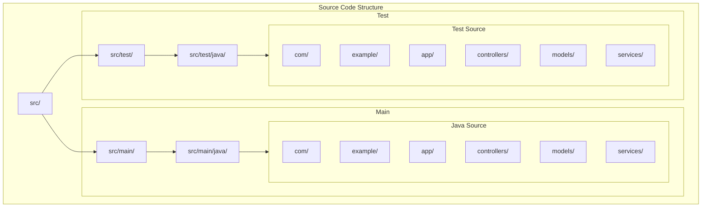

# Shell Demo Database Utility

## Source Code Structure



## Project Overview

This project follows a standard Maven/Java project structure with separate source and test directories. The main application code is organized under `src/main/java` while test code resides in `src/test/java`.

### Main Components

- `controllers/` - REST controllers and API endpoints
- `models/` - Domain models and data structures
- `services/` - Business logic and service implementations

### Testing

- Tests mirror the main source structure
- Each component has corresponding test classes
- Located under `src/test/java`

## Development

### Prerequisites

- Java 11 or higher
- Maven 3.6+

### Project Analysis & Testing

The project includes comprehensive tools for code analysis, structure verification, and testing:

#### 1. Project Structure Analysis
```bash
# Show complete project structure
./scripts/project-analysis/analyze.sh structure

# Shows:
- Directory hierarchy
- File counts by type
- Package organization
- Memory bank structure
```

#### 2. Code Pattern Analysis
```bash
# Find similar code patterns
./scripts/project-analysis/analyze.sh similar 'pattern' ['*.ext']

# Examples:
./scripts/project-analysis/analyze.sh similar 'class.*implements' '*.java'
./scripts/project-analysis/analyze.sh similar 'function.*export' '*.js'
```

#### 3. Package Structure Analysis
```bash
# Analyze Java package organization
./scripts/project-analysis/analyze.sh packages

# Shows:
- Package hierarchy
- Class/interface declarations
- Dependencies between packages
```

#### 4. File Location Suggestions
```bash
# Get suggestions for new files
./scripts/project-analysis/analyze.sh suggest filename.ext

# Examples:
./scripts/project-analysis/analyze.sh suggest UserService.java
./scripts/project-analysis/analyze.sh suggest config.yaml
```

#### 5. Duplicate Detection
```bash
# Check for potential duplicates
./scripts/project-analysis/analyze.sh check filename.ext ['pattern']

# Examples:
./scripts/project-analysis/analyze.sh check '*.java'
./scripts/project-analysis/analyze.sh check UserService.java 'class.*Service'
```

### Best Practices

1. **Before Adding New Code**:
   ```bash
   # Check existing structure
   ./scripts/project-analysis/analyze.sh structure

   # Get location suggestions
   ./scripts/project-analysis/analyze.sh suggest newfile.ext

   # Check for duplicates
   ./scripts/project-analysis/analyze.sh check newfile.ext
   ```

2. **During Code Review**:
   ```bash
   # Find similar patterns
   ./scripts/project-analysis/analyze.sh similar 'pattern' '*.ext'

   # Check package structure
   ./scripts/project-analysis/analyze.sh packages
   ```

3. **Project Maintenance**:
   ```bash
   # Verify structure
   ./scripts/project-analysis/analyze.sh structure

   # Check for duplicates
   ./scripts/project-analysis/analyze.sh check '*.ext'
   ```

### Building

```bash
mvn clean install
```

### Running Tests

```bash
mvn test
```

## Documentation

For detailed documentation about the project's memory bank and development practices, see:
- [Memory Bank Documentation](memory-bank/README.md)
- [Technical Context](memory-bank/core/techContext.mdc)
- [System Patterns](memory-bank/core/systemPatterns.mdc)
- [Project Scripts](memory-bank/core/scripts.mdc)

# Database Utility Tool

## Database Configuration

### Oracle Database Password
When running the application in a dev container, the database password for the application user is automatically generated for security. To retrieve the current password, you can use either of these methods:

1. Using the provided script:
   ```bash
   ./.devcontainer/get-db-password.sh
   ```

2. Direct file access:
   ```bash
   cat /run/secrets/app_user_password
   ```

Note: The password is regenerated each time the dev container is rebuilt, but remains consistent during the container's lifetime.

### Oracle Database Passwords

When using the `gvenzl/oracle-free` image without specifying passwords, they are automatically generated for security. To retrieve the passwords:

```bash
# Get all Oracle passwords
make get-oracle-passwords

# Or individually:
# For SYSTEM user
docker exec oracledb cat /opt/oracle/oradata/.docker_temp_password

# For APP_USER (HR)
docker exec oracledb cat /opt/oracle/oradata/.app_user_temp_password
```

Note: These passwords persist as long as the Oracle data volume exists. They will be regenerated if you remove the volume and recreate the container.

## Configuration System

### Overview
The application uses a custom configuration system built around `ConfigurationHolder` and `YamlConfigReader`:

- `ConfigurationHolder`: Singleton that loads and caches configuration at startup
- `YamlConfigReader`: Reads YAML configuration files using Jackson
- Default configuration loaded from `application.yaml`
- Runtime properties managed through `DatabaseProperties`

### Environment Variables
Environment variables are handled through:
1. `.env` file in `.devcontainer` directory
2. Variables loaded into environment when container starts
3. Accessed through `System.getenv()`

### Configuration Hierarchy
(highest to lowest priority)

1. Environment Variables
   - Set in `.devcontainer/.env`
   - Override all other configuration sources
   - Loaded when container starts

2. Runtime Properties
   - Set through `DatabaseProperties.setRuntimeProperty()`
   - Can be modified during application execution
   - Cached in `ConfigurationHolder`

3. YAML Configuration
   - Primary configuration in `application.yaml`
   - Database instances in `dblist.yaml`
   - Provides default values

### Key Components

1. Core Classes
   - `ConfigurationHolder`: Singleton that manages all configuration
   - `DatabaseProperties`: Manages database-specific properties
   - `ConnectionConfig`: Base class for connection configuration
   - `LdapServerConfig`: LDAP-specific configuration

2. Configuration Files
   - `.devcontainer/.env`: Container environment variables
   - `application.yaml`: Main application configuration
   - `dblist.yaml`: Database instance definitions
   - `log4j2.xml`: Logging configuration

### Implementation Details
1. Configuration Loading
   - YAML files parsed using Jackson
   - Environment variables loaded at container startup
   - Configuration cached for performance

2. Type Safety
   - Model classes for structured configuration
   - Validation at startup
   - Strong typing for all configuration values

3. Security
   - Sensitive data stored in environment variables
   - Passwords and keys masked in logs
   - Secure default values

### Best Practices

1. Sensitive Data
   - Store in environment variables
   - Never commit to version control
   - Mask in logs using `********`

2. Configuration Access
   - Use `DatabaseProperties` for database config
   - Access environment variables through system
   - Cache configuration for performance

3. Type Safety
   - Use model classes (`ConnectionConfig`, `LdapServerConfig`)
   - Validate configuration at startup
   - Provide meaningful error messages

4. Design Principles
   - Configuration is externalized
   - Clear separation of concerns
   - Consistent access patterns
   - Fail-fast validation

### Usage Example
```java
// Access configuration through ConfigurationHolder
DatabaseConfig config = ConfigurationHolder.getInstance().getDatabaseConfig();

// Set runtime property
DatabaseProperties.setRuntimeProperty("db.timeout", "30");

// Access environment variable
String dbPassword = System.getenv("DB_PASSWORD");
```

## Logging Configuration

### Overview
The application uses a two-tier logging system:
1. Regular application logging (`logger`)
2. Method-specific detailed logging (`methodLogger`)

### Log Levels
- **TRACE**: Detailed operation information (SQL queries, parameter values)
- **DEBUG**: Operation lifecycle events (method entry/exit, state changes)
- **INFO**: Important state changes and operation results
- **ERROR**: Failures with detailed context

### Configuration

#### Method-Specific Debug Logging
To enable detailed method-level logging, add the following to your `logback.xml` or `log4j2.xml`:

```xml
<!-- Regular application logging -->
<logger name="com.example.shelldemo" level="INFO"/>

<!-- Method-specific detailed logging -->
<logger name="com.example.shelldemo.UnifiedDatabaseRunner.methods" level="DEBUG">
    <appender-ref ref="CONSOLE"/>
    <appender-ref ref="METHOD_DEBUG_FILE"/>
</logger>
```

#### Log File Configuration
```xml
<!-- Regular log file -->
<appender name="FILE" class="ch.qos.logback.core.rolling.RollingFileAppender">
    <file>logs/application.log</file>
    <rollingPolicy class="ch.qos.logback.core.rolling.TimeBasedRollingPolicy">
        <fileNamePattern>logs/application.%d{yyyy-MM-dd}.log</fileNamePattern>
        <maxHistory>30</maxHistory>
    </rollingPolicy>
    <encoder>
        <pattern>%d{yyyy-MM-dd HH:mm:ss} [%thread] %-5level %logger{36} - %msg%n</pattern>
    </encoder>
</appender>

<!-- Method debug log file -->
<appender name="METHOD_DEBUG_FILE" class="ch.qos.logback.core.rolling.RollingFileAppender">
    <file>logs/method-debug.log</file>
    <rollingPolicy class="ch.qos.logback.core.rolling.TimeBasedRollingPolicy">
        <fileNamePattern>logs/method-debug.%d{yyyy-MM-dd}.log</fileNamePattern>
        <maxHistory>7</maxHistory>
    </rollingPolicy>
    <encoder>
        <pattern>%d{yyyy-MM-dd HH:mm:ss} [%thread] %-5level - %msg%n</pattern>
    </encoder>
</appender>
```

### Available Debug Information

#### Database Operations
- Script execution progress
- SQL statement details
- Statement execution status
- Parameter values (masked for sensitive data)
- Execution times

#### Stored Procedures
- Parameter parsing details
- Execution progress
- Return values
- Error context

#### Configuration
- Database connection details
- Configuration validation
- Driver loading status

### Example Log Output

Regular application log:
```
2024-03-15 10:30:45 [main] INFO  UnifiedDatabaseRunner - Executing SQL script: /path/to/script.sql
2024-03-15 10:30:46 [main] INFO  UnifiedDatabaseRunner - Script execution completed successfully - 5 statements executed
```

Method-specific debug log:
```
2024-03-15 10:30:45 [main] DEBUG [executeScript] Starting execution of script: script.sql
2024-03-15 10:30:45 [main] DEBUG [executeScript] Parsed 5 SQL statements from file
2024-03-15 10:30:45 [main] DEBUG [executeScript] Processing statement 1/5
2024-03-15 10:30:45 [main] DEBUG [executeScript] Statement 1/5 executed successfully
```

### Enabling Debug Logging

1. **Production Environment**:
   - Set regular logging to `INFO`
   - Disable method-specific logging or set to `ERROR`

2. **Development Environment**:
   - Set regular logging to `DEBUG`
   - Set method-specific logging to `DEBUG` or `TRACE`

3. **Troubleshooting**:
   - Enable method-specific logging: `DEBUG` or `TRACE`
   - Check `logs/method-debug.log` for detailed execution flow

### Performance Considerations
- Method-specific logging at `TRACE` level may impact performance
- Use `DEBUG` level for general troubleshooting
- In production, keep method-specific logging at `ERROR` or disabled

### Log File Locations
- Regular logs: `logs/application.log`
- Method debug logs: `logs/method-debug.log`
- Rolling policy: Daily rotation with compression
- Retention: 30 days for regular logs, 7 days for debug logs

# Maven Version Management Commands

```bash
# Display all dependency updates
mvn versions:display-dependency-updates

# Display plugin updates
mvn versions:display-plugin-updates

# Display property updates (checks properties used in versions)
mvn versions:display-property-updates

# Update all dependencies to their latest versions
mvn versions:use-latest-versions

# Update a specific property version
mvn versions:set-property -Dproperty=spring-shell.version -DnewVersion=3.2.1

# Set project version
mvn versions:set -DnewVersion=1.0.1-SNAPSHOT

# Revert changes made by versions:set
mvn versions:revert

# Commit changes made by versions:set
mvn versions:commit

# Update parent version
mvn versions:update-parent

# Force updating snapshots
mvn versions:use-latest-versions -DallowSnapshots=true

# Update versions excluding specific dependencies
mvn versions:use-latest-versions -Dexcludes=org.springframework.*:*

# Generate dependency tree report
mvn versions:dependency-updates-report

# Update to the next snapshot version
mvn versions:set -DnextSnapshot=true

# Lock snapshots to their current timestamp version
mvn versions:lock-snapshots

# Unlock snapshots
mvn versions:unlock-snapshots
```

Tips for version management:
- Always review changes before committing
- Use `display-*` commands to preview updates
- Backup `pom.xml` before making major version changes
- Test thoroughly after version updates
- Consider using `-DallowMajorUpdates=false` for safer updates
- Use `-DprocessParent=true` to include parent POM in updates

### Maven Shade Plugin Configuration

#### Log4j2 Plugin Transformer
To properly merge Log4j2 resources and prevent resource overlap warnings during the build, the following configuration is added to the Maven Shade Plugin:

```xml
<transformer implementation="com.github.edwgiz.maven_shade_plugin.log4j2_cache_transformer.PluginsCacheFileTransformer" />
```

This transformer requires an additional dependency in the plugin configuration:

```xml
<dependencies>
  <dependency>
    <groupId>com.github.edwgiz</groupId>
    <artifactId>maven-shade-plugin.log4j2-cachefile-transformer</artifactId>
    <version>2.15</version>
  </dependency>
</dependencies>
```

This configuration:
- Properly merges Log4j2 plugin cache files
- Eliminates resource overlap warnings
- Ensures correct loading of Log4j2 plugins in the shaded JAR
- Handles the `META-INF/org/apache/logging/log4j/core/config/plugins/Log4j2Plugins.dat` resource

After adding this configuration, the warning about overlapping Log4j2 resources during the Maven build process will be resolved.

docker exec <container_name> cat /run/secrets/app_user_password

git config --global user.name "swapan chakrabarty" &&\
git config --global user.email "swapan.chakrabarty@datahawklab.com"

git config --global init.defaultBranch main
git config --global pull.rebase false
git config --global core.fileMode false
git config --global core.longpaths true
git config --global core.symlinks true
```

# Project Documentation

## Analysis & Testing Tools

### 1. Project Structure Analysis
```bash
# Show complete project structure
./scripts/project-analysis/analyze.sh structure

# Shows:
- Directory hierarchy
- File counts by type
- Package organization
- Memory bank structure
```

### 2. Code Pattern Analysis
```bash
# Find similar code patterns
./scripts/project-analysis/analyze.sh similar 'pattern' ['*.ext']

# Examples:
./scripts/project-analysis/analyze.sh similar 'class.*implements' '*.java'
./scripts/project-analysis/analyze.sh similar 'function.*export' '*.js'
```

### 3. Package Structure Analysis
```bash
# Analyze Java package organization
./scripts/project-analysis/analyze.sh packages

# Shows:
- Package hierarchy
- Class/interface declarations
- Dependencies between packages
```

### 4. File Location Suggestions
```bash
# Get suggestions for new files
./scripts/project-analysis/analyze.sh suggest filename.ext

# Examples:
./scripts/project-analysis/analyze.sh suggest UserService.java
./scripts/project-analysis/analyze.sh suggest config.yaml
```

### 5. Duplicate Detection
```bash
# Check for potential duplicates
./scripts/project-analysis/analyze.sh check filename.ext ['pattern']

# Examples:
./scripts/project-analysis/analyze.sh check '*.java'
./scripts/project-analysis/analyze.sh check UserService.java 'class.*Service'
```

## Best Practices

### 1. Before Adding New Code
```bash
# Check existing structure
./scripts/project-analysis/analyze.sh structure

# Get location suggestions
./scripts/project-analysis/analyze.sh suggest newfile.ext

# Check for duplicates
./scripts/project-analysis/analyze.sh check newfile.ext
```

### 2. During Code Review
```bash
# Find similar patterns
./scripts/project-analysis/analyze.sh similar 'pattern' '*.ext'

# Check package structure
./scripts/project-analysis/analyze.sh packages
```

### 3. Project Maintenance
```bash
# Verify structure
./scripts/project-analysis/analyze.sh structure

# Check for duplicates
./scripts/project-analysis/analyze.sh check '*.ext'
```

## Command Output Examples

### Structure Analysis
```
Project Structure:
└── src/
    ├── main/
    │   └── java/
    │       └── com/example/
    │           ├── controllers/
    │           ├── services/
    │           └── models/
    └── test/
        └── java/
            └── com/example/
                └── tests/

File counts:
- Java: 45 files
- Tests: 32 files
- Config: 8 files
```

### Pattern Analysis
```
Similar patterns found:
1. UserService.java:120 - "implements UserRepository"
2. ProductService.java:85 - "implements ProductRepository"
3. OrderService.java:150 - "implements OrderRepository"
```

### Package Analysis
```
Package hierarchy:
com.example
├── controllers
│   ├── UserController
│   └── ProductController
├── services
│   ├── UserService
│   └── ProductService
└── models
    ├── User
    └── Product
```

### File Suggestions
```
Suggested locations for UserService.java:
1. src/main/java/com/example/services/
2. src/main/java/com/example/core/services/
3. src/main/java/com/example/user/services/
```

### Duplicate Check
```
Potential duplicates found:
1. UserService.java ~ UserServiceImpl.java (80% similar)
2. ProductDTO.java ~ ProductModel.java (65% similar)
```

## Usage Guidelines

1. **Regular Analysis**:
   - Run structure analysis weekly
   - Check for duplicates during reviews
   - Analyze packages before refactoring

2. **Code Organization**:
   - Follow package suggestions
   - Keep similar patterns consistent
   - Document significant deviations

3. **Maintenance**:
   - Update after major changes
   - Clean up duplicate patterns
   - Maintain consistent structure

## Testing Dependencies

### Core Testing Libraries
The parent POM includes these essential testing dependencies:

- **JUnit Jupiter (junit-jupiter)** - The main testing framework
- **Mockito Core (mockito-core)** - For mocking in unit tests
- **Mockito JUnit Jupiter (mockito-junit-jupiter)** - Integration between Mockito and JUnit

### Additional Testing Libraries
For more comprehensive testing capabilities, we've added:

- **AssertJ** - Provides fluent assertions that are more readable and IDE-friendly
  ```java
  assertThat(result).isEqualTo(expected)
  ```

- **Hamcrest** - Offers powerful matchers for complex assertions
  ```java
  assertThat(result, hasProperty("name", equalTo("test")))
  ```

- **JUnit Pioneer** - Adds useful extensions for JUnit Jupiter like temporary directory improvements and system property handling
  ```java
  @TempDir
  Path tempDir;
  ```

- **JsonAssert** - Specifically for testing JSON structures (useful since we're using Jackson)
  ```java
  JSONAssert.assertEquals(expectedJson, actualJson, false)
  ```

### Dependency Management
- All testing dependencies are defined in the parent POM for version consistency
- Dependencies are added with `<scope>test</scope>` in module POMs
- Test dependencies are only available during testing, not in the production classpath

