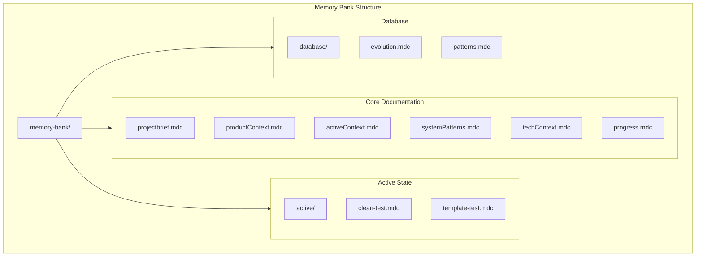
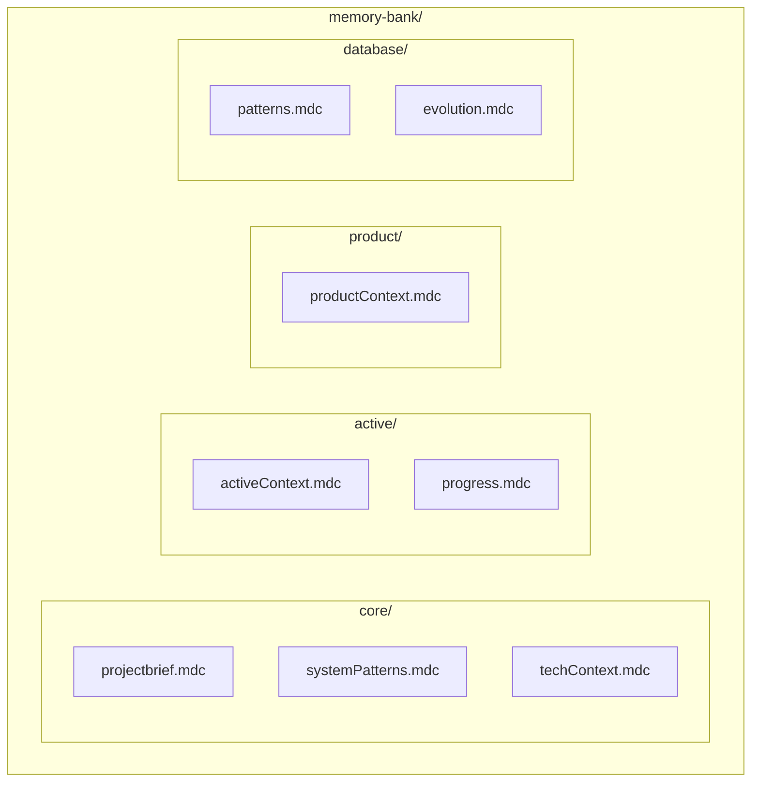

# Memory Bank

This directory contains the project's memory bank - a collection of documentation that helps maintain context and history across development sessions.

## Structure



## Directory Contents

- `core/` - Core project documentation
- `active/` - Current state and active work
- `database/` - Database-specific documentation
- `product/` - Product-related documentation

## File Types

- `.mdc` - Memory bank documentation files
- `.md` - Standard markdown files (being migrated to .mdc)

## Usage

1. All memory bank files should use the `.mdc` extension
2. Use templates from `.cursor/rules/templates/memory-bank/` when applicable
3. Use `edit_file` for clean files without templates
4. Keep current state separate from history
5. Update documentation when making significant changes

## Directory Structure
```
/memory-bank/                  # Project-wide, permanent memory
├── README.md                  # This file
├── current_state.md          # SINGLE SOURCE OF TRUTH - Current system state
├── core/                     # Core project documentation
│   ├── projectbrief.md      # Project requirements and goals
│   ├── systemPatterns.md    # Architectural patterns
│   └── techContext.md       # Technical context
├── active/                   # Current state and progress
│   ├── activeContext.md     # Current focus and decisions
│   └── progress.md          # Project progress
├── product/                  # Product documentation
│   └── productContext.md    # Product context and goals
└── database/                # Database-specific memory
    ├── patterns.md          # Database patterns
    └── evolution.md         # Database changes history

/.cursor/memory-bank/         # IDE-specific, temporary memory
├── code_history.md          # Recent code changes
└── project_context.md       # Current development context
```

## Quick Access
```bash
# Get current system state
cat memory-bank/current_state.md

# Check project patterns
cat memory-bank/core/*

# View recent changes
cat .cursor/memory-bank/code_history.md
```

## Usage Guidelines

1. **Current State vs. History**
   - `current_state.md`: SINGLE SOURCE OF TRUTH for current system state
   - Other files: Historical context and evolution

2. **When to Use Each**
   - New to codebase? → `current_state.md`
   - Making changes? → `current_state.md` + relevant pattern files
   - Understanding history? → Evolution and history files
   - Recent changes? → `.cursor/memory-bank/`

3. **Update Frequency**
   - `current_state.md`: After EVERY change (CRITICAL)
   - `activeContext.md`: Major changes
   - `progress.md`: Task completion
   - `code_history.md`: Code changes
   - Pattern files: When patterns change

4. **Cross-References**
   - Always reference `current_state.md` first
   - Link to historical context when needed
   - Keep temporary and permanent memory in sync

## Best Practices

1. **Before Making Changes**
   - ALWAYS check `current_state.md` first
   - Review relevant patterns
   - Check recent changes

2. **After Making Changes**
   - Update `current_state.md` IMMEDIATELY
   - Update history files
   - Sync temporary memory

3. **Documentation Standards**
   - Use YAML for configuration
   - Use Mermaid for diagrams
   - Keep sections focused
   - Cross-reference when needed

4. **Memory Maintenance**
   - Keep `current_state.md` up to date
   - Archive completed work
   - Clean temporary memory
   - Sync documentation regularly

## Current State Updates

The `current_state.md` file MUST include:
1. Active Configuration
   - Container states
   - Access patterns
   - Schema details
   - Initialization checks

2. Current Patterns
   - Make targets
   - Connection patterns
   - Test structure
   - Initialization sequence

3. Active Context
   - Current issues
   - Recent changes
   - Next steps
   - Quick reference

4. Update Process
   ```bash
   # After any change
   vim memory-bank/current_state.md  # Update relevant sections
   git commit -m "Update current state: [WHAT CHANGED]"
   ```

## Memory Bank Documentation

## Overview
The Memory Bank is our project's knowledge repository, ensuring consistent documentation and project understanding across sessions.

## Directory Structure


## Analysis & Testing Tools

### 1. Memory Bank Structure Analysis
```bash
# Analyze memory bank structure
./scripts/project-analysis/analyze.sh structure

# Shows:
- Memory bank file organization
- File counts by type (.mdc, .md)
- Directory hierarchy
```

### 2. Memory Bank File Suggestions
```bash
# Get suggestions for new memory bank files
./scripts/project-analysis/analyze.sh suggest filename.mdc

# Examples:
./scripts/project-analysis/analyze.sh suggest feature.mdc
./scripts/project-analysis/analyze.sh suggest deployment.mdc
```

### 3. Duplicate Content Detection
```bash
# Check for duplicate documentation
./scripts/project-analysis/analyze.sh check filename.mdc ['pattern']

# Examples:
./scripts/project-analysis/analyze.sh check config.mdc
./scripts/project-analysis/analyze.sh check patterns.mdc 'pattern.*implementation'
```

### 4. Content Pattern Search
```bash
# Find similar documentation patterns
./scripts/project-analysis/analyze.sh similar 'pattern' '*.mdc'

# Examples:
./scripts/project-analysis/analyze.sh similar 'deployment.*process' '*.mdc'
./scripts/project-analysis/analyze.sh similar 'configuration.*setup' '*.mdc'
```

## Best Practices

### 1. Before Adding New Documentation
```bash
# Check existing structure
./scripts/project-analysis/analyze.sh structure

# Get location suggestions
./scripts/project-analysis/analyze.sh suggest newdoc.mdc

# Check for duplicates
./scripts/project-analysis/analyze.sh check newdoc.mdc
```

### 2. During Documentation Review
```bash
# Find similar content
./scripts/project-analysis/analyze.sh similar 'topic.*pattern' '*.mdc'

# Check structure
./scripts/project-analysis/analyze.sh structure
```

### 3. Regular Maintenance
```bash
# Verify structure
./scripts/project-analysis/analyze.sh structure

# Check for duplicate content
./scripts/project-analysis/analyze.sh check '*.mdc'
```

## File Types

### Memory Bank Files (.mdc)
- Core documentation
- Current state tracking
- System patterns
- Technical context
- Progress tracking

### Standard Markdown (.md)
- READMEs
- Quick notes
- Files being migrated to .mdc

## Usage Guidelines

1. **Use Templates**:
   - Check `.cursor/rules/templates/memory-bank/` for templates
   - Use `process_template.sh` for new files

2. **Keep Current State Separate**:
   - Use `active/` for current work
   - Use `core/` for stable documentation
   - Use `product/` for product context
   - Use `database/` for database-specific docs

3. **Regular Updates**:
   - Update after significant changes
   - Keep progress.mdc current
   - Document decisions in activeContext.mdc
   - Track system evolution in appropriate files

4. **File Organization**:
   - Use descriptive names
   - Follow directory structure
   - Keep related docs together
   - Use cross-references when needed 