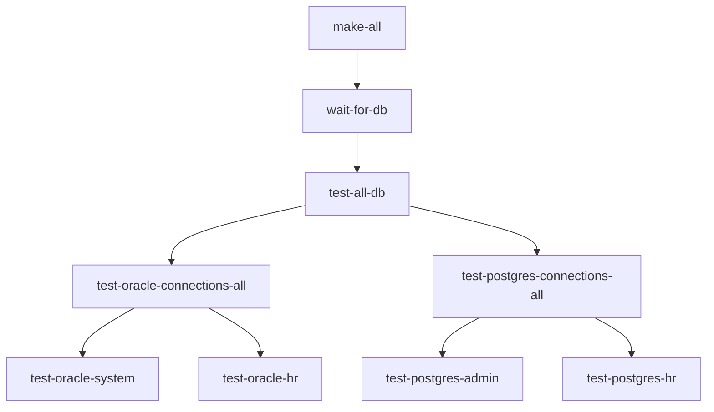

# Current System State

## Active Database Configuration

### Oracle Database
```yaml
Container:
  Name: oracledb
  Status: Running
  PDB: FREEPDB1

Access:
  System: system/SecurePassword@localhost:1521/FREEPDB1
  HR: hr/HR@localhost:1521/FREEPDB1
  
Schema:
  HR:
    - employees
    - departments
    - jobs
    - locations
    - countries
    - regions
    - job_history

Initialization:
  Ready Check: "DATABASE IS READY TO USE!"
  PDB Check: "FREEPDB1 IS READY TO USE"
```

### PostgreSQL Database
```yaml
Container:
  Name: postgresdb
  Status: Running

Access:
  Admin: postgres (superuser)
  HR: hr/HR

Schema:
  HR:
    - employees
    - departments
    - jobs
    - locations
    - countries
    - regions
    - job_history

Initialization:
  Ready Check: "database system is ready to accept connections"
```

## Current Test Structure


## Active Make Targets
```makefile
# Database Tests
test-oracle-connections-all: test-oracle-system test-oracle-hr
test-postgres-connections-all: test-postgres-admin test-postgres-hr
test-all-db: test-oracle-connections-all test-postgres-connections-all

# Database Readiness
wait-for-db: analyze-oracle-logs analyze-postgres-logs

# Complete Flow
make-all: all wait-for-db test-all-db
```

## Current Database Patterns

### Connection Patterns
```makefile
# Oracle
@docker exec oracledb sqlplus -S system/SecurePassword@localhost:1521/FREEPDB1
@docker exec oracledb sqlplus -S hr/HR@localhost:1521/FREEPDB1

# PostgreSQL
@docker exec postgresdb psql -U postgres
@docker exec postgresdb psql -U hr
```

### Initialization Patterns
```makefile
# Oracle
@docker logs oracledb 2>&1 | grep "DATABASE IS READY TO USE!"
@docker logs oracledb 2>&1 | grep "FREEPDB1 IS READY TO USE"

# PostgreSQL
@docker logs postgresdb 2>&1 | grep "database system is ready"
```

## Active Issues/Tasks
1. PostgreSQL HR user needs creation during initialization
2. Database readiness checks need log pattern documentation
3. Schema synchronization between Oracle and PostgreSQL pending

## Recent Changes
1. Added hierarchical test structure
2. Implemented database readiness checks
3. Created memory bank organization
4. Added log analysis for startup patterns

## Next Steps
1. Implement PostgreSQL user creation in init scripts
2. Add schema synchronization checks
3. Enhance log pattern documentation
4. Add performance monitoring

## Quick Reference
```yaml
Containers:
  Oracle: oracledb:latest
  PostgreSQL: postgres:latest

Ports:
  Oracle: 1521
  PostgreSQL: 5432

Users:
  Oracle:
    - system/SecurePassword
    - hr/HR
  PostgreSQL:
    - postgres
    - hr/HR

Key Files:
  Oracle Init: .devcontainer/docker/oracle/init-scripts/
  PostgreSQL Init: .devcontainer/docker/postgres/init-scripts/
  Make: Makefile
  Memory: memory-bank/
``` 