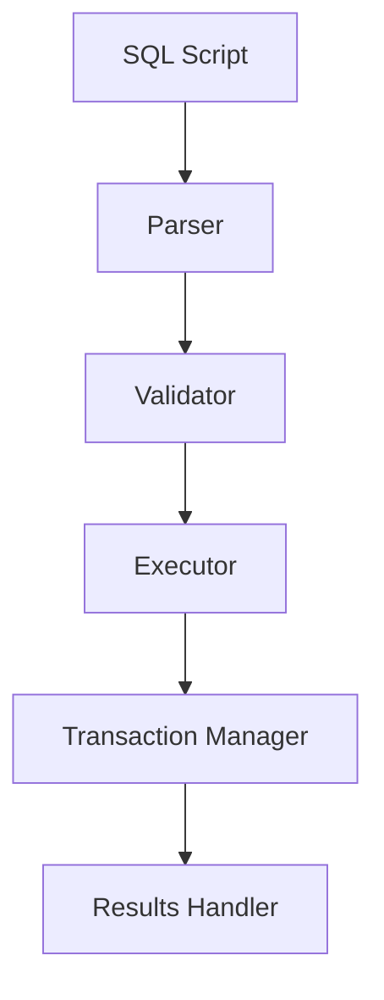
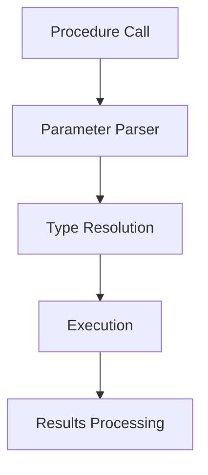
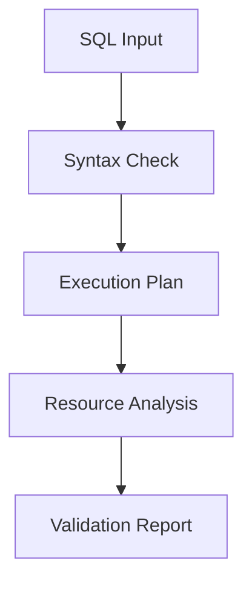
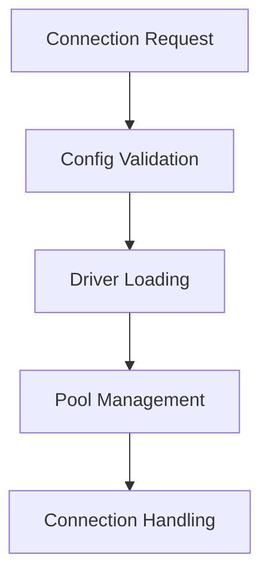

# Product Context
<!-- markdownlint-disable MD022 MD032 MD022 MD02 MD009 MD047 MD028 MD037 MD040-->
## Purpose

The Shell Demo Database Utility is a comprehensive command-line tool designed to streamline database operations across multiple database systems. It serves as a unified interface for database administrators, developers, and DevOps engineers to interact with different database platforms using a consistent set of commands and workflows.

## Problems Solved

### 1. Database Heterogeneity
- **Challenge**: Organizations often use multiple database systems (Oracle, SQL Server, PostgreSQL, MySQL)
- **Solution**: Provides a unified interface that abstracts away database-specific differences
- **Benefit**: Users can work with any supported database using the same commands and patterns

### 2. Script Execution Complexity
- **Challenge**: Managing SQL script execution across different environments
- **Solution**: Robust script parsing and execution with transaction support
- **Benefit**: Reliable and consistent script execution with proper error handling

### 3. Stored Procedure Management
- **Challenge**: Different syntax and calling conventions for stored procedures
- **Solution**: Unified stored procedure execution interface with parameter handling
- **Benefit**: Simplified stored procedure management across database platforms

### 4. SQL Validation
- **Challenge**: Catching SQL errors before production deployment
- **Solution**: Pre-flight validation with execution plan generation
- **Benefit**: Reduced risk of deployment failures and performance issues

### 5. Driver Management
- **Challenge**: Managing JDBC drivers for different databases
- **Solution**: Dynamic driver loading via SPI with custom driver support
- **Benefit**: Flexible driver management without hard dependencies

## Core Functionality

### 1. SQL Script Execution


- Parses SQL files into individual statements
- Handles different SQL dialects and comment styles
- Supports transaction management for DML scripts via CLI flag (--transactional)
- Provides detailed execution feedback

### 2. Stored Procedure Execution


- Supports IN, OUT, and INOUT parameters
- Handles different parameter types
- Returns procedure results
- Manages function return values

### 3. Validation Features


- SQL syntax validation
- Execution plan generation
- PL/SQL block validation
- Resource usage estimation

### 4. Connection Management


- Secure connection handling
- Connection pooling
- Custom driver support
- Connection validation

## User Experience

### 1. Command-Line Interface
```bash
db -t oracle -H localhost -P 1521 -u system -p password -d ORCLPDB1 script.sql
# Optional: --transactional to execute DML scripts in a transaction
```

- Intuitive command structure
- Consistent across databases
- Comprehensive help system
- Error feedback
- **Optional transactional DML script execution via --transactional flag**

### 2. Configuration Options
- Database-specific settings
- Connection parameters
- Execution preferences
- Logging configuration

### 3. Output Formats
- Console output
- CSV export
- Execution logs
- Error reports

## Use Cases

### 1. Development
- Execute database changes
- Test stored procedures
- Validate SQL scripts
- Debug database issues

### 2. Deployment
- Run migration scripts
- Validate changes pre-deployment
- Execute post-deployment checks
- Manage database updates

### 3. Administration
- Monitor database health
- Execute maintenance tasks
- Manage database objects
- Handle configuration changes

### 4. Testing
- Validate database changes
- Run test scripts
- Verify stored procedures
- Check database connectivity

## Integration Points

### 1. Database Systems
- Oracle Database
- Microsoft SQL Server
- PostgreSQL
- MySQL

### 2. Development Tools
- Version Control Systems
- CI/CD Pipelines
- Build Tools
- Testing Frameworks

### 3. Monitoring Systems
- Logging Integration
- Performance Monitoring
- Error Tracking
- Audit Trail

## Future Enhancements

### 1. Planned Features
- Schema comparison tools
- Data migration utilities
- Performance optimization suggestions
- Enhanced security features

### 2. Integration Opportunities
- Cloud database support
- Container orchestration
- Additional database types
- API interface

## Success Metrics

### 1. Performance
- Script execution time
- Connection management efficiency
- Resource utilization
- Response times

### 2. Reliability
- Error handling effectiveness
- Transaction consistency
- Data integrity
- System stability

### 3. Usability
- Command completion time
- Learning curve reduction
- Error message clarity
- Documentation effectiveness

## Target Users

### Primary Users

1. **Database Developers**
   - Need to validate SQL before execution
   - Write code that works across different SQL dialects
   - Generate SQL programmatically for complex applications

2. **Database Administrators (DBAs)**
   - Analyze large SQL files for performance optimization
   - Review queries for security vulnerabilities
   - Migrate databases between different systems

3. **Tool Developers**
   - Build SQL intelligence into IDEs and editors
   - Create database visualization tools
   - Develop SQL linting and formatting utilities

4. **Data Engineers**
   - Transform queries between different data systems
   - Analyze data pipelines containing SQL
   - Generate complex queries dynamically

### Secondary Users

1. **Data Scientists**
   - Validate SQL used in data analysis workflows
   - Transform ad-hoc queries into optimized versions

2. **Security Analysts**
   - Scan codebases for SQL injection vulnerabilities
   - Audit database access patterns

3. **Technical Educators**
   - Create SQL training tools
   - Demonstrate SQL dialect differences

## User Stories

### Database Developer

> "As a database developer, I want to validate my SQL queries during development, so I can catch syntax errors before they reach production."

> "As a database developer working with multiple databases, I need to transform SQL between dialects without manual rewriting to save time and reduce errors."

### Database Administrator

> "As a DBA, I need to analyze complex SQL scripts to find potential performance bottlenecks, so I can optimize database operations."

> "As a DBA migrating from Oracle to PostgreSQL, I need to automatically identify incompatible SQL constructs to plan my migration strategy."

### Tool Developer

> "As an IDE plugin developer, I want to integrate SQL parsing capabilities so I can provide real-time validation and autocomplete for users."

> "As a developer of a database visualization tool, I need to extract table relationships from SQL queries to generate accurate schema diagrams."

### Data Engineer

> "As a data engineer, I need to refactor complex legacy SQL to make it more maintainable and performant without changing its behavior."

> "As a data engineer working with a microservice architecture, I need to track SQL usage across services to understand data dependencies."

## Use Cases

### Core Use Cases

1. **SQL Validation**
   - Check syntax correctness for specific dialect
   - Provide detailed error messages with suggestions
   - Support batch validation of multiple SQL files

2. **Dialect Transformation**
   - Convert SQL from one dialect to another
   - Identify dialect-specific constructs
   - Suggest alternatives for incompatible features

3. **Query Analysis**
   - Extract tables and columns referenced in queries
   - Identify join conditions and query patterns
   - Calculate query complexity metrics

4. **SQL Generation**
   - Programmatically build complex queries
   - Ensure generated SQL is syntactically correct
   - Optimize generated queries automatically

### Advanced Use Cases

1. **Security Analysis**
   - Detect potential SQL injection vulnerabilities
   - Identify excessive privilege usage
   - Find sensitive data access patterns

2. **Performance Optimization**
   - Suggest indexing strategies based on query patterns
   - Identify inefficient constructs
   - Recommend query rewrites

3. **Schema Extraction**
   - Generate database schema from DDL statements
   - Track schema changes over time
   - Compare schemas across environments

4. **SQL Refactoring**
   - Break down complex queries into simpler components
   - Standardize SQL coding style
   - Modernize legacy SQL constructs

## Product Requirements

### Functional Requirements

1. **Parser Capabilities**
   - Parse standard ANSI SQL and major dialects (MySQL, PostgreSQL, SQLite, MS SQL)
   - Provide detailed error messages for invalid SQL
   - Return complete AST for valid SQL statements

2. **Transformation Features**
   - Convert between supported SQL dialects
   - Maintain statement semantics during transformation
   - Provide warnings for potentially incompatible conversions

3. **Analysis Features**
   - Extract table/column references and relationships
   - Identify query patterns and anti-patterns
   - Generate query metrics (complexity, nesting depth, etc.)

4. **Integration Capabilities**
   - Provide programmatic API for developers
   - Offer command-line interface for scripts and tools
   - Support streaming for large SQL files

### Non-Functional Requirements

1. **Performance**
   - Parse large SQL files efficiently (>100MB)
   - Minimize memory usage during parsing
   - Process common queries in <10ms

2. **Reliability**
   - Recover gracefully from parsing errors
   - Provide meaningful diagnostics
   - Handle edge cases correctly

3. **Extensibility**
   - Support plugin architecture for custom dialects
   - Allow custom rules for analysis
   - Enable custom transformations

4. **Usability**
   - Clear, consistent API design
   - Comprehensive documentation
   - Helpful error messages

## User Experience Goals

1. **Developer Experience**
   - Intuitive API that follows established patterns
   - Clear documentation with examples
   - Predictable behavior across dialects

2. **Error Handling**
   - Detailed error messages that pinpoint issues
   - Suggestions for fixing common problems
   - Context-aware error recovery

3. **Performance Perception**
   - Fast response for typical queries
   - Efficient handling of large SQL files
   - Progress indicators for long operations

4. **Integration Experience**
   - Easy to integrate with existing tools
   - Consistent behavior across platforms
   - Flexible output formats

## Success Metrics

### Adoption Metrics

- Number of active users/installations
- Usage across different SQL dialects
- Community contributions and extensions

### Technical Metrics

- Parsing accuracy across test suite
- Performance benchmarks for parsing speed
- Memory usage for various input sizes

### User Satisfaction Metrics

- Error message helpfulness ratings
- Documentation completeness feedback
- Feature request fulfillment rate

## Competitor Analysis

### Open Source Alternatives

1. **ANTLR SQL Grammars**
   - Strengths: Comprehensive grammars, strong community
   - Weaknesses: Limited error recovery, no dialect transformation

2. **PgSQL Parser**
   - Strengths: Accurate PostgreSQL parsing
   - Weaknesses: Single dialect, limited analysis capabilities

3. **JSqlParser**
   - Strengths: Java ecosystem integration, mature project
   - Weaknesses: Performance issues with large files, limited dialects

### Commercial Products

1. **SQL Server Management Studio Parser**
   - Strengths: Deep SQL Server integration, powerful analysis
   - Weaknesses: Single dialect, not available as standalone library

2. **Redgate SQL Prompt**
   - Strengths: Excellent refactoring capabilities, IDE integration
   - Weaknesses: Limited to SQL Server, closed ecosystem

## Roadmap Priorities

### Short-term (3 months)

1. Core parser implementation for ANSI SQL
2. Support for MySQL and PostgreSQL dialects
3. Basic analysis capabilities (table/column extraction)
4. Command-line interface for validation

### Medium-term (6-12 months)

1. Support for additional dialects (SQLite, MS SQL)
2. Dialect transformation capabilities
3. Advanced analysis features
4. Plugin system for extensibility

### Long-term (12+ months)

1. IDE integrations
2. Query optimization suggestions
3. Schema-aware validation
4. Visual query representation

## Value Proposition

Our SQL Parser provides a unique combination of features that differentiate it from alternatives:

1. **Multi-dialect Support**: Parse and transform SQL across all major database systems
2. **Developer-Friendly Design**: Intuitive API with clear error messages and documentation
3. **Extensibility**: Plugin architecture for custom dialects and analysis rules
4. **Performance**: Efficient handling of large SQL files with minimal memory footprint
5. **Comprehensive Analysis**: Extract insights from SQL beyond basic syntax validation

By addressing the needs of database developers, administrators, and tool builders, our SQL Parser enables more efficient SQL development, simplified cross-database compatibility, and deeper query analysis capabilities.
