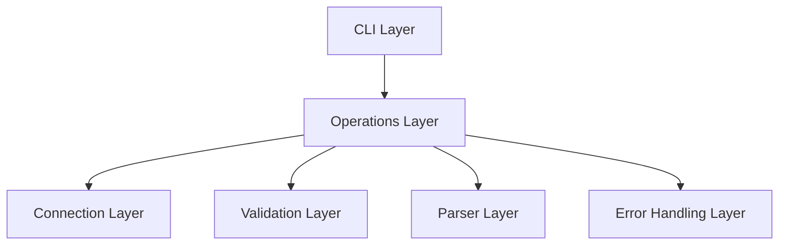
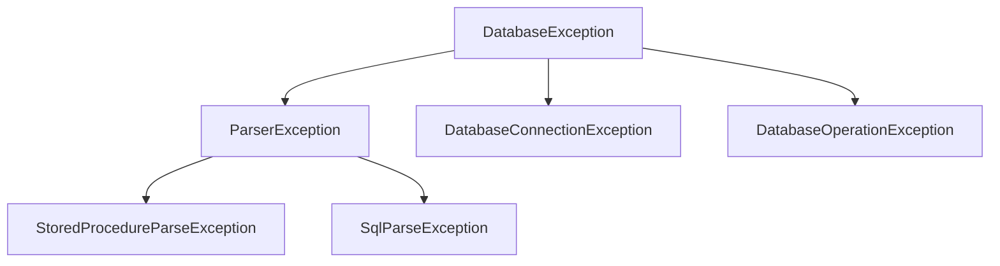

# System Patterns

## Core Architecture

The system follows a layered architecture with clear separation of concerns:



### 1. CLI Layer
- Entry point through `UnifiedDatabaseRunner`
- Command-line argument processing
- Initial configuration loading
- Operation orchestration

### 2. Operations Layer
- Core business logic in `UnifiedDatabaseOperation`
- Transaction management
- Statement execution
- Resource cleanup
- Partitions DML and non-DML statements for script execution; DML can be executed transactionally via CLI flag
- Enforces builder pattern: UnifiedDatabaseOperation must be constructed via UnifiedDatabaseOperation.builder()

### 3. Connection Layer
- Database connectivity management
- Driver loading via SPI
- Connection pooling and lifecycle
- Connection configuration

### 4. Validation Layer
- SQL syntax validation
- PL/SQL block validation
- Execution plan generation
- Statement type detection

### 5. Parser Layer
- SQL script parsing
- Stored procedure parsing
- Statement separation
- Comment handling

### 6. Error Layer
- Exception hierarchy
- Error formatting
- DBMS-specific error mapping
- Error context preservation

## Design Patterns

### 1. Builder Pattern
Used in `UnifiedDatabaseOperation` for flexible object construction:
```java
UnifiedDatabaseOperation operation = new UnifiedDatabaseOperation.Builder()
    .host(host)
    .port(port)
    .username(username)
    // ... other properties
    .build();
```

### 2. Factory Pattern
Implemented in `DatabaseConnectionFactory` for creating database connections:
- Encapsulates connection creation logic
- Handles different database types
- Manages connection properties
- Provides connection validation

### 3. Strategy Pattern
Applied in SQL execution handling:
```java
@FunctionalInterface
public interface SqlExecutor {
    Object execute(Statement stmt, String sql) throws SQLException;
}

private static final SqlExecutor PLSQL_EXECUTOR = (stmt, sql) -> {
    // PL/SQL execution strategy
};

private static final SqlExecutor SQL_EXECUTOR = (stmt, sql) -> {
    // Regular SQL execution strategy
};
```

### 4. Facade Pattern
`UnifiedDatabaseOperation` acts as a facade, providing a simplified interface for:
- Script execution
- Stored procedure calls
- Validation operations
- Transaction management

### 5. Context Object Pattern
Used in validation operations:
```java
public class DatabaseOperationValidationContext {
    private final Connection connection;
    private final boolean showExplainPlan;
    private int statementCount;
    private String currentUsername;
    // ... methods
}
```

### 6. SPI Pattern
Implemented for JDBC driver loading:
- Dynamic driver discovery
- Driver wrapping
- ServiceLoader integration

### Builder Pattern
- All instances of UnifiedDatabaseOperation must be constructed via the static builder() method for consistency and discoverability.

## Error Handling Pattern

### 1. Exception Hierarchy


### 2. Error Type Enumeration
- Categorized error codes
- Vendor-specific mappings
- Context preservation
- Standardized formatting

## Validation Patterns

### 1. Pre-execution Validation
- Syntax checking
- PL/SQL block validation
- Execution plan generation
- Parameter validation

### 2. Statement Type Detection
```java
public boolean isPLSQL(String sql) {
    return sql.startsWith("BEGIN") ||
           sql.startsWith("DECLARE") ||
           sql.startsWith("CREATE") ||
           sql.contains("END;");
}
```

## Parser Patterns

### 1. SQL Script Parsing
- Comment removal
- Statement separation
- PL/SQL block detection
- Error recovery

### 2. Stored Procedure Parsing
- Parameter extraction
- Type determination
- Name resolution
- Validation rules

## Resource Management Pattern

### 1. AutoCloseable Implementation
```java
try (UnifiedDatabaseOperation operation = new UnifiedDatabaseOperation.Builder()
        .build()) {
    // Use operation
}
```

### 2. Transaction Management
- Auto-commit handling
- Rollback on failure
- Resource cleanup
- Connection lifecycle
- DML statements in scripts can be executed in a transaction if requested via CLI flag; DDL/PLSQL always non-transactional

## Testing Patterns

### 1. Unit Testing
- Isolated component testing
- Mock database connections
- Error condition verification
- Parser validation

### 2. Integration Testing
- Cross-component testing
- Database interaction testing
- Transaction verification
- Error propagation testing
- Integration tests verify both transactional and non-transactional DML script execution via CLI

## Database Operations Pattern
- UnifiedDatabaseOperation class serves as the main entry point for database operations
- Uses Builder pattern (UnifiedDatabaseOperationBuilder) for construction
- Implements AutoCloseable for resource management
- Separates concerns:
  - ResultSetProcessor for processing result sets
  - ResultSetStreamer interface for streaming large results
  - BatchExecutor for batch operations
  - StatementExecutor for SQL execution
  - DatabaseErrorHandler for error management

## Validation Pattern
- Dedicated validator classes (StoredProcedureValidator, DatabaserOperationValidator)
- Static validation methods with clear error messages
- Throws DatabaseException with specific ErrorType

## Testing Pattern
- DatabaseLoginService for connection testing
- Uses virtual threads for concurrent testing
- Records test results in CSV format
