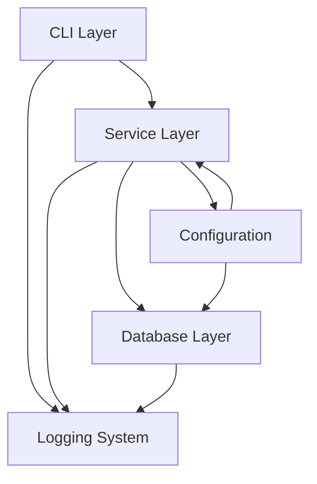

# System Patterns

## Architecture Overview
The system follows a command-line application architecture with the following layers:
- CLI Interface Layer (PicoCLI)
- Service Layer (Business Logic)
- Database Access Layer (Oracle JDBC)
- Logging and Monitoring Layer
- Configuration Management Layer

## Design Patterns
- Command Pattern (PicoCLI implementation)
- Factory Pattern (for database connections)
- Singleton Pattern (for configuration management)
- Strategy Pattern (for different database operations)
- Builder Pattern (for complex object construction)
- Observer Pattern (for logging and monitoring)

## Component Structure

## Data Flow
1. Command input through CLI
2. Command parsing and validation
3. Service layer business logic execution
4. Database operations through JDBC
5. Result processing and formatting
6. Output presentation
7. Logging throughout the process

## Key Technical Decisions
- Java 21 for modern language features
- PicoCLI for robust command-line parsing
- Multiple logging frameworks for comprehensive logging
- Testcontainers for integration testing
- Maven for build and dependency management
- Cross-platform support through conditional compilation

## System Boundaries
- CLI Interface: Command input/output boundary
- Database Interface: Oracle JDBC connection boundary
- File System: Log files and configuration storage
- Operating System: Platform-specific operations
- Network: Database connectivity

## Security Patterns
- Secure password handling
- Connection pooling
- Prepared statements for SQL
- Logging security (sensitive data masking)
- Configuration encryption where needed

Note: Update this document as architectural decisions are made. 