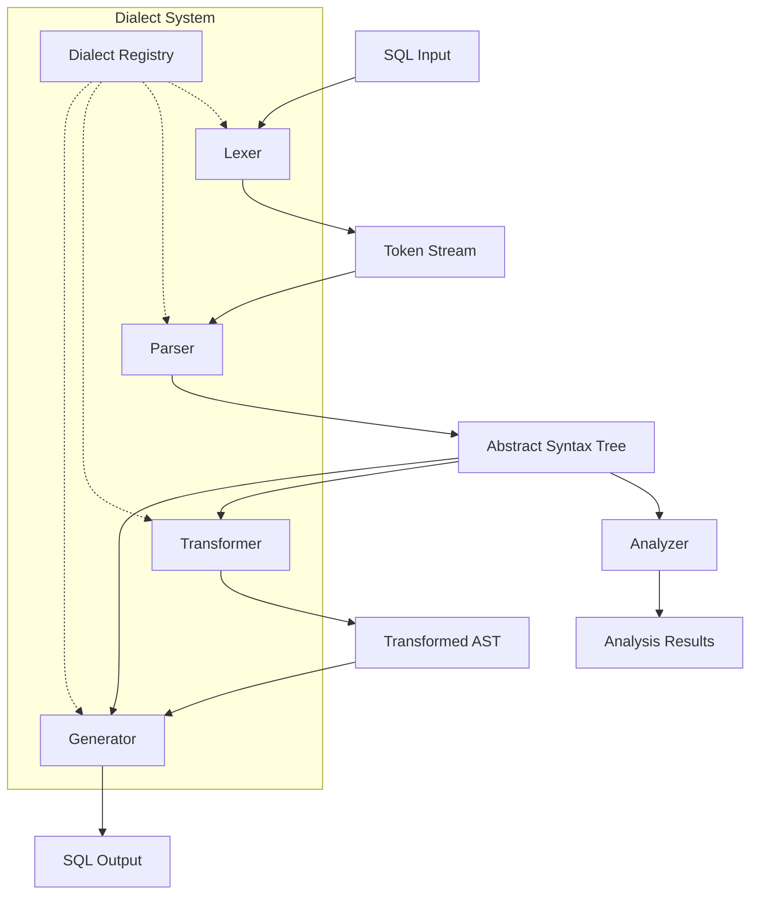
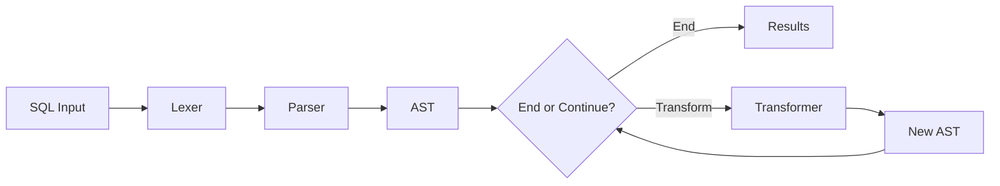
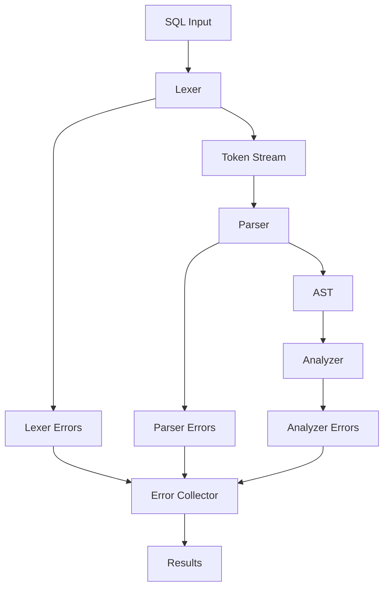

# System Patterns<!-- markdownlint-disable MD022 MD032 MD022 MD02 MD009 MD047 MD028 MD037 MD040-->
## Architecture Overview

The SQL Parser is designed with a modular, pipeline-based architecture that enables flexibility, extensibility, and high performance. The system follows a multi-stage parsing approach with clear separation of concerns.



## Core Components

### 1. Lexer

The lexer is responsible for tokenizing SQL input into a stream of tokens.

**Key Patterns:**
- **Token Definition**: Each SQL token type (keywords, identifiers, literals, operators) is clearly defined
- **State Management**: The lexer maintains state for handling complex tokens (quoted strings, comments)
- **Error Recovery**: The lexer can recover from common syntax errors to continue processing
- **Dialect Awareness**: Token definitions can vary based on the active SQL dialect

```typescript
// Token type definition
export enum TokenType {
  KEYWORD,
  IDENTIFIER,
  STRING_LITERAL,
  NUMERIC_LITERAL,
  OPERATOR,
  PUNCTUATION,
  WHITESPACE,
  COMMENT,
  ERROR,
  EOF
}

// Token interface
export interface Token {
  type: TokenType;
  value: string;
  start: number;
  end: number;
  line: number;
  column: number;
}
```

### 2. Parser

The parser consumes the token stream and produces an Abstract Syntax Tree (AST) representing the SQL statement structure.

**Key Patterns:**
- **Recursive Descent**: Implements a recursive descent parser for clear, maintainable code
- **Lookahead**: Uses lookahead to resolve ambiguities in the grammar
- **Error Handling**: Provides detailed error messages with context and suggestions
- **AST Node Types**: Defines a clear hierarchy of node types representing SQL constructs

```typescript
// Base AST node interface
export interface ASTNode {
  type: string;
  start: number;
  end: number;
}

// Example of a SELECT statement node
export interface SelectStatement extends ASTNode {
  type: 'SELECT_STATEMENT';
  columns: Array<ColumnReference | Expression>;
  from?: TableReference;
  where?: Expression;
  groupBy?: Array<Expression>;
  having?: Expression;
  orderBy?: Array<OrderByExpression>;
  limit?: Expression;
  offset?: Expression;
}
```

### 3. Analyzer

The analyzer performs various analyses on the AST without modifying it.

**Key Patterns:**
- **Visitor Pattern**: Uses the visitor pattern to traverse the AST
- **Collection Builders**: Builds collections of references, dependencies, etc.
- **Metrics Calculation**: Computes complexity metrics and other statistics
- **Plugin System**: Allows custom analyzers to be plugged in

```typescript
// Visitor interface
export interface Visitor {
  visitSelectStatement(node: SelectStatement): void;
  visitTableReference(node: TableReference): void;
  visitColumnReference(node: ColumnReference): void;
  // Other visit methods...
}

// Example analyzer using visitor pattern
export class TableReferenceAnalyzer implements Visitor {
  private tables: Set<string> = new Set();
  
  // Implementation of visitor methods
  visitTableReference(node: TableReference): void {
    this.tables.add(node.name);
  }
  
  // Method to get analysis results
  getTables(): string[] {
    return Array.from(this.tables);
  }
}
```

### 4. Transformer

The transformer modifies the AST to create new SQL variants or optimized versions.

**Key Patterns:**
- **Tree Transformation**: Implements AST-to-AST transformations
- **Dialect Mapping**: Maps constructs between different SQL dialects
- **Rule-Based Transformations**: Applies transformation rules based on patterns
- **Immutability**: Creates new AST nodes rather than modifying existing ones

```typescript
// Transformer interface
export interface Transformer {
  transform(ast: ASTNode): ASTNode;
}

// Example dialect transformer
export class MySQLToPostgreSQLTransformer implements Transformer {
  transform(ast: ASTNode): ASTNode {
    // Implementation of dialect-specific transformations
    return transformedAst;
  }
}
```

### 5. Generator

The generator produces SQL text from an AST, with options for formatting and dialect-specific syntax.

**Key Patterns:**
- **Visitor-Based Generation**: Uses visitors to generate SQL from AST nodes
- **Formatting Controls**: Supports various formatting options (indentation, line breaks)
- **Dialect-Specific Output**: Generates SQL specific to the target dialect
- **Optimization Hints**: Can include optimizer hints based on the target system

```typescript
// SQL Generator interface
export interface SQLGenerator {
  generate(ast: ASTNode): string;
}

// Example PostgreSQL generator
export class PostgreSQLGenerator implements SQLGenerator {
  private options: GeneratorOptions;
  
  constructor(options: GeneratorOptions) {
    this.options = options;
  }
  
  generate(ast: ASTNode): string {
    // Implementation of PostgreSQL-specific generation
    return sqlString;
  }
}
```

## Cross-Cutting Patterns

### 1. Dialect System

The dialect system manages SQL dialect variations across all components.

**Key Patterns:**
- **Dialect Registry**: Central registry of supported dialects and their features
- **Feature Detection**: Ability to check if a feature is supported in a dialect
- **Inheritance**: Dialects can inherit from a common base (e.g., ANSI SQL)
- **Extensibility**: Custom dialects can be registered by users

```typescript
// Dialect interface
export interface Dialect {
  name: string;
  extends?: string;
  features: Set<string>;
  supportsFeature(feature: string): boolean;
}

// Dialect registry
export class DialectRegistry {
  private dialects: Map<string, Dialect> = new Map();
  
  register(dialect: Dialect): void {
    this.dialects.set(dialect.name, dialect);
  }
  
  getDialect(name: string): Dialect | undefined {
    return this.dialects.get(name);
  }
}
```

### 2. Error Handling

Comprehensive error handling strategy across all components.

**Key Patterns:**
- **Detailed Error Objects**: Error objects with position, context, and suggestions
- **Error Recovery**: Ability to continue parsing after encountering errors
- **Error Aggregation**: Collection of multiple errors in a single pass
- **Custom Error Types**: Specific error types for different kinds of issues

```typescript
// SQL Error interface
export interface SQLError {
  message: string;
  code: string;
  start: number;
  end: number;
  line: number;
  column: number;
  suggestion?: string;
  severity: 'ERROR' | 'WARNING' | 'INFO';
}

// Error collector
export class ErrorCollector {
  private errors: SQLError[] = [];
  
  addError(error: SQLError): void {
    this.errors.push(error);
  }
  
  hasErrors(): boolean {
    return this.errors.some(e => e.severity === 'ERROR');
  }
  
  getErrors(): SQLError[] {
    return this.errors;
  }
}
```

### 3. Plugin System

Extensibility through a plugin architecture.

**Key Patterns:**
- **Plugin Registry**: Central registry for plugins
- **Hook Points**: Well-defined extension points throughout the system
- **Plugin API**: Clear API for developing plugins
- **Plugin Discovery**: Automatic discovery of installed plugins

```typescript
// Plugin interface
export interface Plugin {
  name: string;
  version: string;
  hooks: Map<string, Function>;
}

// Plugin registry
export class PluginRegistry {
  private plugins: Map<string, Plugin> = new Map();
  
  register(plugin: Plugin): void {
    this.plugins.set(plugin.name, plugin);
  }
  
  getPlugin(name: string): Plugin | undefined {
    return this.plugins.get(name);
  }
  
  getHooks(hookName: string): Function[] {
    const hooks: Function[] = [];
    this.plugins.forEach(plugin => {
      const hook = plugin.hooks.get(hookName);
      if (hook) hooks.push(hook);
    });
    return hooks;
  }
}
```

## Data Flow

### 1. Parsing Pipeline

The main data flow through the system follows a pipeline pattern.



**Key Patterns:**
- **Streaming**: Support for streaming large inputs
- **Pipeline Configuration**: Configurable pipeline stages
- **Early Termination**: Ability to stop at any stage and return results
- **Parallel Processing**: Potential for parallel processing of independent statements

### 2. Error Propagation

Errors flow through the system alongside valid results.



**Key Patterns:**
- **Error Collection**: Errors are collected rather than immediately throwing
- **Error Context**: Errors maintain context about their source
- **Error Severity**: Errors have different severity levels
- **Error Reporting**: Unified error reporting interface

## Design Decisions

### 1. Handwritten Parser vs. Parser Generator

The system uses a handwritten recursive descent parser rather than a parser generator.

**Rationale:**
- **Flexibility**: More control over error handling and recovery
- **Performance**: Can be optimized for specific SQL parsing needs
- **Maintainability**: Easier to understand and modify for SQL-specific cases
- **Debugging**: Simpler debugging and troubleshooting

### 2. Immutable AST

The AST is designed to be immutable, with transformations creating new AST instances.

**Rationale:**
- **Predictability**: Prevents unexpected side effects during analysis
- **Parallelism**: Enables parallel processing without locking
- **Debugging**: Makes it easier to track changes and debug
- **Functional Style**: Aligns with functional programming patterns

### 3. Visitor Pattern for Traversal

The system uses the visitor pattern extensively for AST traversal.

**Rationale:**
- **Separation of Concerns**: Separates traversal logic from node logic
- **Extensibility**: Easy to add new operations without modifying node classes
- **Type Safety**: Provides type safety for different node types
- **Standardization**: Consistent approach across different components

### 4. Plugin Architecture

The system is designed with a plugin architecture for extensibility.

**Rationale:**
- **Extensibility**: Allows users to extend functionality without modifying core code
- **Modularity**: Enables modular development and testing
- **Community Contributions**: Facilitates community-contributed extensions
- **Feature Selection**: Users can select only the features they need

## Future Architectural Considerations

### 1. Web Assembly Support

Potential for compiling the parser to WebAssembly for browser use.

**Considerations:**
- **Performance**: WASM could provide near-native performance in browsers
- **Size**: Need to optimize for download size
- **API Design**: May require adapting the API for WASM context
- **Browser Compatibility**: Consider browser compatibility issues

### 2. Language Server Protocol Integration

Integration with the Language Server Protocol for IDE support.

**Considerations:**
- **Protocol Alignment**: Mapping SQL parser concepts to LSP
- **Performance**: Ensuring responsiveness for interactive use
- **Feature Support**: Implementing required LSP features (completion, validation)
- **Extension Mechanism**: Leveraging existing plugin system for LSP features

### 3. Incremental Parsing

Support for incremental parsing to improve performance for interactive use.

**Considerations:**
- **Change Tracking**: Efficient tracking of changes in the source
- **AST Reuse**: Reusing parts of the AST that haven't changed
- **Performance Tradeoffs**: Balancing complexity vs. performance gains
- **API Design**: Designing a clean API for incremental updates 